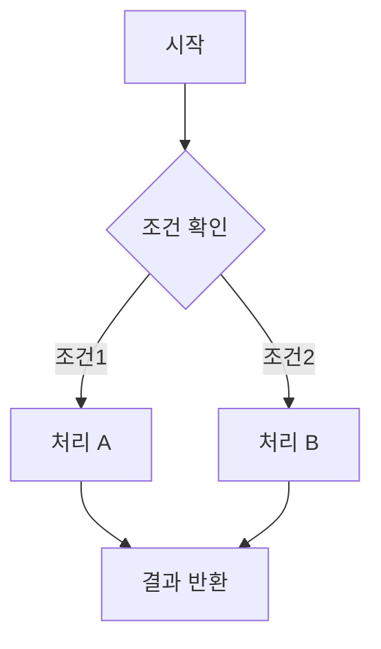
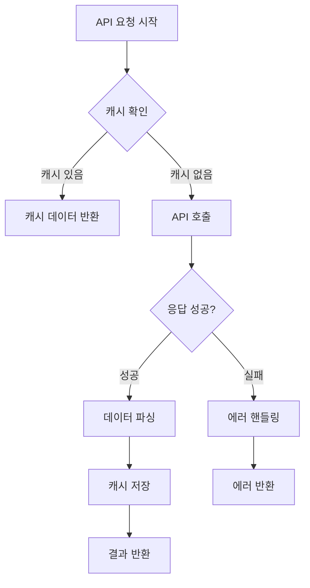
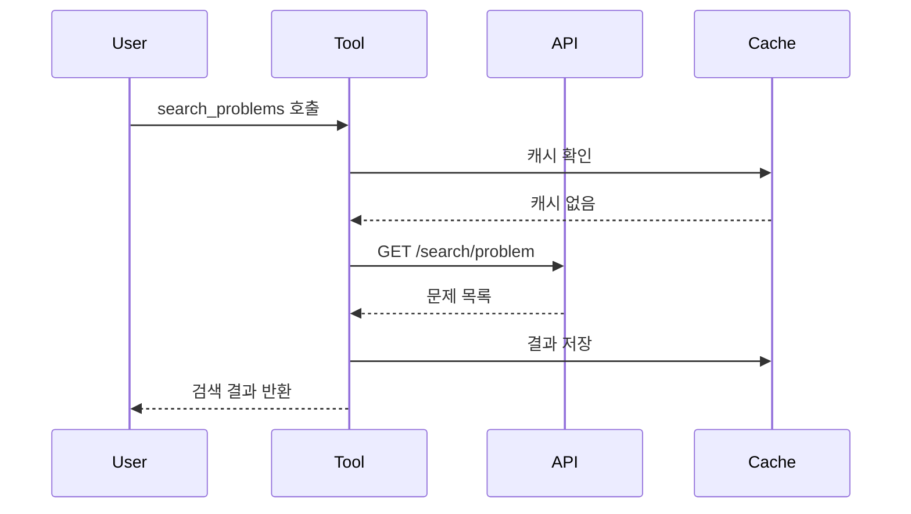
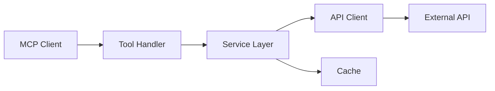

이 스킬은 태스크가 끝나고 나서 태스크에 대한 보고서를 작성하는 스킬입니다.

**핵심 역할:**

Task가 완료된 후, 수행한 작업을 팀장에게 보고하는 형식으로 체계적이고 명확한 보고서를 작성합니다.

**작성 위치:**

- 경로: `<프로젝트경로>/stash/ai_logs/`
- 파일명: `YYYYMMDD_<num>_작업내용.md` (예: `20260213_2_api_client_implementation.md`)

**파일 넘버링 규칙**:
1. 먼저 해당 날짜의 기존 파일들을 확인합니다
2. 패턴: `YYYYMMDD_*_*.md` (예: `20260213_*_*.md`)
3. 마지막 번호를 찾아 +1 한 값을 사용합니다
4. 기존 파일이 없으면 1부터 시작합니다

**넘버링 확인 방법**:
```bash
# 오늘 날짜의 기존 보고서 파일 확인
ls -1 stash/ai_logs/YYYYMMDD_*.md 2>/dev/null | tail -1

# 예시: 20260213_3_some_task.md가 마지막이면
# 다음 파일명: 20260213_4_작업내용.md
```

**보고서 구조:**

```markdown
# [작업 제목]

**작업일**: YYYY-MM-DD
**담당**: Claude Sonnet 4.5
**소요 시간**: [예상 시간]
**상태**: ✅ 완료 / 🚧 진행중 / ⚠️ 이슈 있음

---

## 1. 작업 개요

### 목적
[왜 이 작업을 했는지 명확히 기술]

### 범위
- [작업 범위 1]
- [작업 범위 2]
- [작업 범위 3]

## 2. 구현 내용

### 2.1 주요 변경사항

#### [컴포넌트/모듈 1]
- **파일**: `경로/파일명.ts`
- **변경 내용**: [무엇을 했는지]
- **이유**: [왜 이렇게 했는지]

#### [컴포넌트/모듈 2]
- **파일**: `경로/파일명.ts`
- **변경 내용**: [무엇을 했는지]
- **이유**: [왜 이렇게 했는지]

### 2.2 기술적 접근

[구현 방식과 핵심 로직 설명]

복잡한 로직이 있다면 플로우 차트로 도식화:



### 2.3 의사결정 및 트레이드오프

#### 주요 의사결정
1. **결정 사항**: [무엇을 선택했는지]
   - **이유**: [왜 선택했는지]
   - **대안**: [다른 선택지는 무엇이었는지]
   - **트레이드오프**: [선택의 장단점]

2. **결정 사항**: [무엇을 선택했는지]
   - **이유**: [왜 선택했는지]
   - **대안**: [다른 선택지는 무엇이었는지]
   - **트레이드오프**: [선택의 장단점]

## 3. 테스트 및 검증

### 3.1 테스트 수행
- [ ] 단위 테스트 작성
- [ ] 통합 테스트 수행
- [ ] 엣지 케이스 검증
- [ ] 에러 핸들링 확인

### 3.2 테스트 결과
[테스트 결과 요약]

## 4. 영향도 분석

### 4.1 변경 영향 범위
- **직접 영향**: [직접적으로 영향받는 컴포넌트/모듈]
- **간접 영향**: [간접적으로 영향받을 수 있는 부분]

### 4.2 호환성
- **하위 호환성**: ✅ 유지 / ⚠️ 주의 필요 / ❌ 깨짐
- **의존성 변경**: [새로 추가되거나 변경된 의존성]

### 4.3 성능 영향
[성능에 미치는 영향 분석]

## 5. 문서화

### 5.1 업데이트된 문서
- [ ] README.md
- [ ] CLAUDE.md
- [ ] docs/api.md
- [ ] docs/architecture.md
- [ ] 기타: [문서명]

### 5.2 코드 주석
- [ ] 복잡한 로직에 주석 추가
- [ ] JSDoc/TSDoc 작성
- [ ] 타입 정의 문서화

## 6. 남은 작업 및 개선사항

### 6.1 후속 작업
- [ ] [후속 작업 1]
- [ ] [후속 작업 2]

### 6.2 개선 제안
- [개선 제안 1]
- [개선 제안 2]

### 6.3 알려진 이슈
- ⚠️ [이슈 1]: [설명]
- ⚠️ [이슈 2]: [설명]

## 7. 참고 자료

- [관련 PR/Issue 링크]
- [참고한 문서/API]
- [관련 기술 블로그]

---

## 요약

[3-5줄로 이 작업을 요약]

```

**작성 원칙:**

### 1. 명확성과 간결성
- 비실무자도 이해할 수 있도록 작성
- 개조식으로 핵심만 간결하게
- 기술 용어 사용 시 간단한 설명 추가
- 문단은 최대 3-4문장으로 제한

### 2. 구조화된 정보
- 계층적 구조로 정보 조직
- 섹션별로 명확한 목적
- 일관된 포맷 유지

### 3. 시각화
- 복잡한 로직은 **반드시** 플로우 차트로 도식화
- Mermaid 다이어그램 적극 활용
- 데이터 흐름은 시퀀스 다이어그램으로 표현

### 4. 맥락 제공
- 작업의 배경과 목적 명확히
- 의사결정 과정 상세히 기록
- 트레이드오프 투명하게 공유
- 향후 참고를 위한 충분한 맥락

### 5. 실용성
- 다음 작업자가 이어받을 수 있도록
- 문제 해결 과정 기록
- 시행착오와 해결책 공유

### 6. 마크다운 가독성
- **강조는 진짜 중요한 단어에만** 사용
- 강조 표시(`**`) 남발 금지
- 마크다운 원본 상태에서도 읽기 편하게
- 과도한 포매팅 지양

**예시: 강조 사용**

❌ 나쁜 예:
```markdown
**API 클라이언트**를 **구현**했습니다. **에러 핸들링**과 **타입 정의**를 **추가**했습니다.
```

✅ 좋은 예:
```markdown
API 클라이언트를 구현했습니다. 에러 핸들링과 타입 정의를 추가했습니다.
단, **레이트 리밋 처리**는 향후 추가 예정입니다.
```

**플로우 차트 예시:**



**시퀀스 다이어그램 예시:**



**아키텍처 다이어그램 예시:**



## 작업 프로세스

### 1단계: 정보 수집
- 완료된 task 내용 파악
- 변경된 파일 목록 확인
- git log, git diff로 상세 변경사항 확인
- 구현 의도와 배경 이해

### 2단계: 구조 설계
- 보고서 섹션별 내용 계획
- 포함할 다이어그램 결정
- 강조할 핵심 포인트 선정

### 3단계: 작성
- 개요부터 순차적으로 작성
- 복잡한 로직은 다이어그램으로 표현
- 의사결정 과정 상세히 기록

### 4단계: 검토
- 비실무자 관점에서 읽기
- 불필요한 강조 제거
- 마크다운 가독성 확인
- 정보의 완결성 검증

### 5단계: 파일 저장
- 해당 날짜의 기존 보고서 파일 확인하여 번호 결정
- `stash/ai_logs/YYYYMMDD_<num>_작업내용.md` 형식으로 저장
- 파일명이 작업 내용을 명확히 표현하는지 확인

**파일 저장 절차**:
```bash
# 1. 해당 날짜의 마지막 번호 확인
ls -1 stash/ai_logs/20260213_*.md 2>/dev/null | tail -1

# 2. 번호 결정 (마지막 번호 + 1, 없으면 1)
# 예: 20260213_2_xxx.md가 마지막 → 다음은 20260213_3_xxx.md

# 3. 파일 생성
cat > stash/ai_logs/20260213_3_작업내용.md << 'ENDOFFILE'
[보고서 내용]
ENDOFFILE
```

## 주의사항

### ✅ 반드시 할 것
1. 작업의 목적과 배경 명확히 설명
2. 복잡한 로직은 플로우 차트로 도식화
3. 의사결정 과정과 트레이드오프 투명하게 공유
4. 비실무자도 이해할 수 있는 언어 사용
5. 향후 참고를 위한 충분한 맥락 제공

### ❌ 하지 말아야 할 것
1. 강조(`**`) 남발하지 않기
2. 기술 용어 남발 (필요시 설명 추가)
3. 코드 전체 복사 붙여넣기 (핵심만)
4. 모호한 표현 ("좀", "적절히", "대략")
5. 과도한 형식적 인사말

## 출력 형식

보고서 작성 완료 후 다음과 같이 안내:

```
✅ 작업 보고서가 작성되었습니다.

파일 위치: stash/ai_logs/20260213_api_client_implementation.md

주요 내용:
- solved.ac API 클라이언트 구현
- 에러 핸들링 및 타입 정의
- 캐싱 전략 수립

다이어그램: 2개 (플로우 차트, 시퀀스 다이어그램)
```

## 활용 예시

### 사용 시점
- 주요 기능 구현 완료 후
- 리팩토링 작업 완료 후
- 버그 수정 완료 후
- 아키텍처 변경 후
- 중요한 의사결정 후

### 호출 방법
```
/report
```

또는

```
작업이 완료되었으니 보고서를 작성해줘
```

보고서는 프로젝트의 기록이자 지식 자산입니다. 미래의 팀원들이 "왜 이렇게 했을까?"라는 질문에 답을 찾을 수 있도록 작성합니다.
