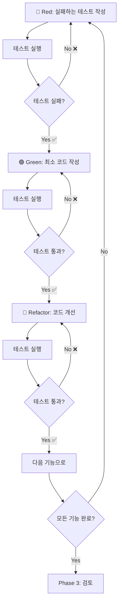
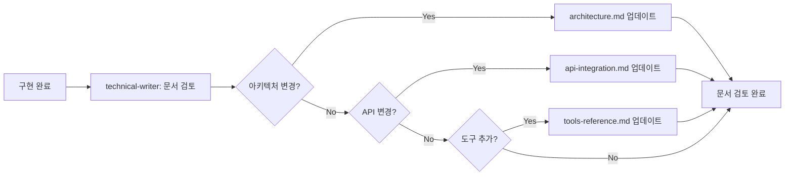
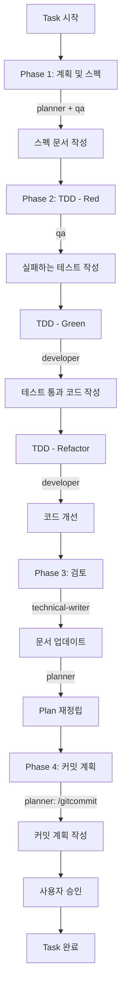

# cote-mcp-server : 코딩테스트 어시스턴트 MCP Server

## 프로젝트 목적

백준 온라인 저지(Baekjoon Online Judge) 알고리즘 문제 학습을 돕는 MCP(Model Context Protocol) 서버입니다. AI 기반으로 문제를 검색하고, 단계별 힌트를 제공하며, 구조화된 복습 문서를 생성합니다.

**프로젝트 이름**: `cote-mcp`
**스킬 Prefix**: `cote:` (향후 슬래시 커맨드용, SuperClaude의 `sc:` prefix에서 영감)

### 한 줄 정의

**백준 ID 기반으로 풀이 이력을 분석하고, 학습 리포트와 문제별 복기 피드백 파일을 자동 생성하는 개인 알고리즘 학습 분석 서버**

## 핵심 철학

### 현재 BOJ 학습의 문제점

1. **전략 없는 문제 풀이**
   - 체계적인 학습 계획 없이 무작위로 문제 선택
   - 현재 수준에 맞지 않는 문제로 시간 낭비

2. **취약 알고리즘 인지 불가**
   - 어떤 알고리즘이 약한지 정량적으로 파악하기 어려움
   - 같은 유형의 문제를 반복적으로 틀림

3. **티어 정체 구간 돌파 전략 부재**
   - Silver-Gold-Platinum 각 구간에서 장기간 정체
   - 다음 단계로 올라가기 위한 명확한 학습 방향성 부족

4. **복기 기록 자동화 없음**
   - 해결한 문제를 다시 보지 않음
   - 풀이 과정에서 배운 점을 기록하지 않음

5. **문제별 개선점 정리 안 함**
   - 왜 틀렸는지, 어떻게 개선할 수 있는지 분석 부재
   - 비슷한 실수를 반복

**결과적으로**: 많이 풀어도 실력이 체계적으로 상승하지 않고, Gold 진입에서 정체됩니다.

### 우리의 솔루션

cote-mcp는 **데이터 기반 학습 분석**과 **AI 기반 개인화 피드백**을 통해 효율적인 알고리즘 학습을 지원합니다.

## 주요 기능

### 1. 필수 기능 (Primary Goal)

#### 1.1 백준 ID 기반 전체 학습 분석 리포트 생성
- **analyze_user**: 백준 사용자 ID로 전체 풀이 이력 분석
- 티어 분포 및 정체 구간 탐지
- 알고리즘별 취약도 정량화
- 맞춤 2주 학습 전략 자동 생성
- 추천 문제 리스트 제공
- 출력: `{boj_id}_learning_report.md`

#### 1.2 특정 문제 풀이 후 복기 파일 자동 생성
- **create_review**: 문제별 구조화된 복습 문서 생성
- 문제 핵심 개념 자동 요약
- 풀이 전략 비교 (최적 풀이 vs 사용자 풀이)
- 시간복잡도 분석 및 개선 포인트 제시
- 배운 점 정리 섹션 제공
- 출력: `boj_reviews/{problem_id}.md`

### 2. 부가 기능 (Secondary Goal)

#### 2.1 문제 검색 및 발견
- **search_problems**: 필터를 사용한 문제 검색 (티어, 태그, 키워드)
- **get_problem**: 특정 문제의 상세 정보 조회
- **search_tags**: 알고리즘 태그 검색

#### 2.2 학습 지원
- **get_hint**: 단계별 힌트 생성 (3단계: 패턴 인식 → 핵심 통찰 → 상세 접근법)

### 3. 향후 슬래시 커맨드 (계획)
- `/cote:analyze` - ID 기반 전체 학습 분석
- `/cote:review` - 문제 복기 문서 생성
- `/cote:search` - 대화형 문제 검색
- `/cote:hint` - 점진적 힌트 제공

### 4. solved.ac API 통합
- 공개 solved.ac API를 활용한 문제 메타데이터 수집
- 인증 불필요
- 티어, 태그, 통계 등 풍부한 데이터 제공

## 프로젝트 구조

```
cote-mcp/
├── src/
│   ├── index.ts                   # MCP 서버 진입점
│   ├── api/
│   │   ├── solvedac-client.ts     # solved.ac API 클라이언트
│   │   └── types.ts               # API 응답 타입 정의
│   ├── tools/
│   │   ├── search-problems.ts     # 문제 검색 도구
│   │   ├── get-problem.ts         # 문제 상세 정보 도구
│   │   ├── search-tags.ts         # 태그 검색 도구
│   │   ├── get-hint.ts            # 힌트 생성 도구
│   │   ├── create-review.ts       # 복습 문서 생성 도구
│   │   └── analyze-user.ts        # 사용자 학습 분석 도구 (신규)
│   ├── services/
│   │   ├── hint-generator.ts      # LLM 기반 힌트 생성 로직
│   │   ├── review-generator.ts    # 복습 템플릿 생성기
│   │   └── analytics-engine.ts    # 학습 분석 엔진 (신규)
│   ├── types/
│   │   └── problem.ts             # 도메인 타입 정의
│   └── utils/
│       ├── tier-converter.ts      # 티어 레벨 ↔ 이름 변환
│       └── cache.ts               # 응답 캐싱 (선택사항)
├── tests/
│   ├── api/
│   └── tools/
├── docs/                           # 문서 (카테고리별 분류)
│   ├── INDEX.md                   # 📍 문서 탐색 가이드
│   ├── CONTRIBUTING.md            # ✍️ 문서 작성 규칙
│   ├── 01-planning/               # 기획 및 설계
│   │   ├── PRD.md                # 제품 요구사항
│   │   ├── SRS.md                # 소프트웨어 요구사항
│   │   └── architecture.md       # 시스템 아키텍처
│   ├── 02-development/            # 개발 가이드
│   │   ├── api-integration.md    # API 통합 가이드
│   │   └── tools-reference.md    # MCP 도구 레퍼런스
│   ├── 03-project-management/     # 프로젝트 관리
│   │   └── tasks.md              # 개발 태스크 및 상태
│   └── 04-testing/                # 테스트 문서
│       ├── test-spec-phase1.md   # Phase 1 테스트 스펙
│       └── test-results-phase1.md # Phase 1 테스트 결과
├── package.json
└── tsconfig.json
```

## 기술 스택

### 핵심 기술
- **MCP SDK**: `@modelcontextprotocol/sdk` v1.26.0
- **TypeScript**: TS 5.9.3로 타입 안전 개발
- **Node.js**: ES2022 모듈 시스템
- **Zod**: 도구 입출력의 런타임 스키마 검증

### 외부 API
- **solved.ac API**: BOJ 문제 데이터를 위한 공개 RESTful API
  - Base URL: `https://solved.ac/api/v3`
  - 인증 불필요
  - 서버 사이드 전용 (CORS 제한)
- **Claude API**: (선택) LLM 기반 힌트 생성용

### 개발 도구
- **vitest**: 모던 테스팅 프레임워크 (v4.0.18)
- **tsx**: 빠른 TypeScript 실행 (개발용)

## 코드베이스 작업 가이드

### MCP 아키텍처 이해

이 서버는 Model Context Protocol을 구현하므로:
- 도구들은 MCP 인터페이스를 통해 노출됨
- 각 도구는 정의된 스키마(입출력)를 가짐
- 도구는 MCP 클라이언트(Claude Desktop 등)에 의해 호출됨
- 서버는 장기 실행 프로세스로 동작

### 핵심 설계 패턴

#### 1. 도구 구조
각 도구는 다음 패턴을 따릅니다:
```typescript
// Zod로 입력 스키마 정의
const InputSchema = z.object({
  field: z.string(),
  // ...
});

// 도구 핸들러 구현
server.tool(
  "tool_name",
  "도구 설명",
  InputSchema,
  async (args) => {
    // 1. 입력 검증
    // 2. API 또는 서비스 레이어 호출
    // 3. 응답 포맷팅
    // 4. 구조화된 출력 반환
  }
);
```

#### 2. API 클라이언트 패턴
- `solvedac-client.ts`는 solved.ac에 대한 HTTP 호출을 래핑
- TypeScript 인터페이스를 사용한 타입화된 응답 반환
- 우아한 에러 처리
- 자주 접근하는 데이터에 대한 선택적 캐싱

#### 3. 서비스 레이어
- `hint-generator.ts`: 힌트용 LLM 프롬프트 엔지니어링 포함
- `review-generator.ts`: 템플릿 기반 복습 생성
- `analytics-engine.ts`: 학습 데이터 분석 로직 (신규)
- 비즈니스 로직을 도구 핸들러에서 분리

### 티어 시스템
BOJ 문제는 1-30 스케일로 평가됩니다:
- 1-5: Bronze V-I (초보자)
- 6-10: Silver V-I (기본 알고리즘)
- 11-15: Gold V-I (중급)
- 16-20: Platinum V-I (고급)
- 21-25: Diamond V-I (전문가)
- 26-30: Ruby V-I (마스터)

숫자가 높을수록 = 더 어려운 난이도

### 일반 작업

#### 새 도구 추가하기
1. `src/tools/`에 도구 파일 생성
2. 입력용 Zod 스키마 정의
3. 도구 핸들러 구현
4. `src/index.ts`에 등록
5. `tests/tools/`에 테스트 추가
6. 문서 업데이트

#### solved.ac API 작업
- 엔드포인트 문서는 `PLAN.md` 확인
- 가능한 경우 API 응답 캐싱
- 레이트 리밋 우아하게 처리
- 태그 키는 표준화됨 (예: "dp", "greedy")

#### 힌트 생성 전략
- 레벨 1: 문제 패턴/알고리즘 유형 식별
- 레벨 2: 완전한 해법 없이 핵심 통찰 제공
- 레벨 3: 상세한 알고리즘 단계 (코드 제외)
- 문제의 태그와 티어를 사용하여 힌트 난이도 조절

#### 복습 생성
- 사용자 입력을 활용한 템플릿 기반
- API에서 가져온 문제 메타데이터 포함
- 태그 기반 관련 문제 제안
- 마크다운 형식 출력

#### 학습 분석 (신규)
- solved.ac API를 통한 사용자 데이터 수집
- 티어 분포 및 알고리즘별 비율 계산
- 취약도 점수 = (평균 제출 횟수 / 전체 평균) × (1 - 정답률) × 100
- 정체 구간 탐지: 최근 40문제 중 같은 티어 75% 이상
- 맞춤 학습 전략 및 문제 추천 생성

### 테스팅
- 개별 도구에 대한 단위 테스트
- API 클라이언트 통합 테스트
- 신뢰성 있는 테스팅을 위한 Mock API 응답
- 모든 테스트에 vitest 사용

### 개발 워크플로우
1. 전체 아키텍처는 `PLAN.md` 참고
2. 관련 영역의 기존 코드 확인
3. 확립된 패턴을 따라 기능 구현
4. 구현과 함께 테스트 작성
5. 문서 업데이트

### 중요 사항
- 프로젝트는 초기 개발 단계
- 일부 컴포넌트는 아직 구현되지 않을 수 있음
- PLAN.md의 단계별 구현 계획 따르기
- 기존 코드 스타일과 일관성 유지
- 사용자 친화적인 에러 메시지 우선순위

### 설정
- solved.ac API에는 API 키 불필요
- 선택사항: 힌트 생성용 Claude API 키 (환경 변수)
- TypeScript strict 모드 활성화
- ES Module 형식 (CommonJS 아님)

## 현재 상태

이 프로젝트는 **Phase 1** 개발 중입니다. 핵심 인프라와 API 통합을 구현하고 있습니다. 상세한 구현 상태는 `docs/tasks.md`를 확인하세요.

## 사용 예시

### 전체 학습 분석
```
사용자: "/cote:analyze shawnhoon"
→ shawnhoon_learning_report.md 생성
→ 티어 분포, 취약 알고리즘, 정체 구간, 2주 학습 전략 포함
```

### 문제 복기
```
사용자: "/cote:review 1927"
→ boj_reviews/1927.md 생성
→ 문제 핵심, 풀이 전략, 개선점, 배운 점 정리
```

### 문제 검색
```
사용자: "Gold 티어의 DP 문제 찾아줘"
→ search_problems 호출
→ 필터링된 문제 목록 제공
```

### 힌트 요청
```
사용자: "11053번 문제 레벨 2 힌트 줘"
→ get_hint 호출
→ 핵심 통찰 제공 (완전한 해법 없이)
```

## Git 작업 방식

### Commit 작업 프로세스

#### 1. 작업 단위 분리
- `git status`로 변경된 파일 확인
- 논리적으로 관련된 변경사항을 하나의 커밋 단위로 그룹화
- 서로 다른 기능/수정은 별도의 커밋으로 분리

#### 2. 커밋 계획 파일 생성 (필수)
커밋 전에 **반드시** ``<현재프로젝트경로>/stash/commit/` 디렉토리에 계획 파일을 생성합니다:

**파일명 형식**: `YYYYMMDD_to_commit.md`

**파일 구조**:
```markdown
# 커밋 계획 - YYYY-MM-DD

## 커밋 1: [타입] 간결한 설명

### 커밋할 파일
- src/api/solvedac-client.ts
- src/tools/search-problems.ts

### 커밋 메시지
[feat] solved.ac API 클라이언트 구현

- solved.ac API 기본 클라이언트 구현
- 문제 검색 도구 추가
- 에러 핸들링 및 타입 정의

## 커밋 2: [타입] 간결한 설명
...
```

#### 3. 사용자 승인 절차 (필수)
커밋 실행 전 다음 정보를 사용자에게 제시하고 승인을 받습니다:
- 수행할 git 명령어
- 커밋될 파일 목록
- 커밋 메시지 내용

**예시**:
```
다음 커밋을 생성하겠습니다:

git add src/api/solvedac-client.ts src/tools/search-problems.ts
git commit -m "[feat] solved.ac API 클라이언트 구현

- solved.ac API 기본 클라이언트 구현
- 문제 검색 도구 추가
- 에러 핸들링 및 타입 정의

Co-Authored-By: Claude Sonnet 4.5 <noreply@anthropic.com>"

진행하시겠습니까?
```

#### 4. Push 금지 정책
- **AI 에이전트는 절대 `git push`를 실행하지 않습니다**
- Push는 사용자가 직접 수행합니다
- 커밋 완료 후 "커밋이 완료되었습니다. Push는 직접 수행해주세요."라고 안내

### 커밋 메시지 양식

한글로 작성하며 다음 형식을 따릅니다:

```
[타입] 간결한 설명

- 주요 변경사항 1
- 주요 변경사항 2
- 주요 변경사항 3
```

#### 타입 분류
- `[feat]`: 새로운 기능 추가
- `[fix]`: 버그 수정
- `[chore]`: 빌드, 설정, 의존성 등 기타 작업
- `[refactor]`: 코드 리팩토링 (기능 변경 없음)
- `[docs]`: 문서 수정
- `[test]`: 테스트 코드 추가/수정

#### 작성 가이드
- **제목**: 최대한 간결하게, 목적과 기능 중심
- **본문**: 개조식으로 주요 변경사항 나열 (3-5개 항목 권장)
- **무엇을 했는지**보다 **왜, 어떤 목적으로** 했는지 명확히

#### 커밋 메시지 예시

**좋은 예시**:
```
[feat] 문제 검색 API 통합 및 필터링 기능 구현

- solved.ac API 클라이언트 기본 구조 구현
- 티어/태그/키워드 기반 문제 검색 기능
- Zod 스키마 검증 추가
- 에러 핸들링 및 타입 안전성 보장
```

**나쁜 예시**:
```
update files

- modified solvedac-client.ts
- added types
```

### Git Worktree 활용

프로젝트 작업 시 **git worktree**를 적극적으로 활용하여 효율적인 병렬 작업을 수행합니다.

#### Worktree란?

Git worktree는 하나의 저장소에서 여러 작업 디렉토리를 동시에 관리할 수 있게 해주는 기능입니다.

#### 주요 장점

1. **브랜치 전환 없이 병렬 작업**
   - 메인 개발 중 긴급 버그 수정 가능
   - 여러 기능을 동시에 개발
   - 브랜치 전환으로 인한 컨텍스트 스위칭 비용 제거

2. **안전한 코드 검증**
   - 다른 브랜치의 코드를 별도 디렉토리에서 확인
   - 현재 작업에 영향 없이 테스트 실행

3. **효율적인 코드 리뷰**
   - PR 브랜치를 별도 worktree로 체크아웃하여 리뷰
   - 메인 작업과 독립적으로 리뷰 및 테스트

#### 기본 사용법

**Worktree 추가**
```bash
# 새 브랜치로 worktree 생성
git worktree add ../cote-mcp-feature-search feature/search-problems

# 기존 브랜치로 worktree 생성
git worktree add ../cote-mcp-bugfix bugfix/api-error

# 특정 커밋에서 새 브랜치로 worktree 생성
git worktree add -b hotfix/critical ../cote-mcp-hotfix abc1234
```

**Worktree 목록 확인**
```bash
git worktree list
```

**Worktree 제거**
```bash
# worktree 디렉토리 삭제
rm -rf ../cote-mcp-feature-search

# git에서 worktree 정보 제거
git worktree prune
```

#### 권장 작업 패턴

**1. 기능 개발 시나리오**
```bash
# 메인 개발 디렉토리
/Users/shawn/dev/projects/cote-mcp-server (main)

# 새 기능 개발용 worktree
git worktree add ../cote-mcp-feat-analytics feature/user-analytics

# 작업 후 커밋
cd ../cote-mcp-feat-analytics
# ... 개발 및 커밋 ...
git push origin feature/user-analytics
```

**2. 긴급 수정 시나리오**
```bash
# 현재 feature 브랜치에서 작업 중
# 긴급 버그 발견 시 별도 worktree로 핫픽스

git worktree add ../cote-mcp-hotfix -b hotfix/api-timeout main
cd ../cote-mcp-hotfix
# ... 버그 수정 및 커밋 ...
git push origin hotfix/api-timeout
```

**3. 코드 리뷰 시나리오**
```bash
# PR 브랜치를 별도 worktree로 체크아웃
git worktree add ../cote-mcp-review-pr123 origin/feature/hint-generator

# 리뷰 및 테스트
cd ../cote-mcp-review-pr123
npm test
# ... 코드 검토 ...

# 리뷰 완료 후 제거
cd ../cote-mcp-server
git worktree remove ../cote-mcp-review-pr123
```

#### 주의사항

1. **동일 브랜치 중복 체크아웃 불가**
   - 같은 브랜치를 여러 worktree에서 동시에 체크아웃할 수 없음
   - 각 worktree는 서로 다른 브랜치를 사용해야 함

2. **Worktree 삭제 시 데이터 손실 주의**
   - 커밋되지 않은 변경사항이 있으면 먼저 커밋 또는 stash
   - `git worktree remove` 전에 반드시 확인

3. **디렉토리 명명 규칙**
   - 프로젝트명-브랜치타입-기능명 형식 권장
   - 예: `cote-mcp-feat-search`, `cote-mcp-fix-timeout`

#### AI 에이전트 사용 시 권장사항

- 복잡한 작업 시 worktree 생성을 적극 제안
- 사용자에게 worktree 활용 방안 안내
- 작업 완료 후 worktree 정리 가이드 제공

### 작업 흐름 요약

1. ✅ `git status`로 변경사항 확인
2. ✅ 작업 단위별로 커밋 그룹화
3. ✅ `stash/commit/YYYYMMDD_to_commit.md` 계획 파일 작성
4. ✅ 사용자에게 커밋 명령어 및 내용 제시하고 승인 요청
5. ✅ 승인 후 `git add` + `git commit` 실행
6. ❌ **절대 `git push` 실행하지 않음**
7. ✅ "커밋 완료, Push는 직접 수행해주세요" 안내

---

## 문서 작성 규칙

### 문서 체계

프로젝트의 모든 문서는 `docs/` 디렉토리에 카테고리별로 분류되어 있습니다.

```
docs/
├── INDEX.md                      # 문서 인덱스 및 탐색 가이드
├── CONTRIBUTING.md               # 문서 작성 규칙 및 가이드라인
├── 01-planning/                  # 기획 및 설계 문서
├── 02-development/               # 개발 가이드
├── 03-project-management/        # 프로젝트 관리 문서
└── 04-testing/                   # 테스트 문서
```

### 핵심 원칙

1. **명확성 (Clarity)**: 기술 용어는 최초 사용 시 정의, 구체적 예제 포함
2. **일관성 (Consistency)**: 동일한 템플릿과 형식 사용, 용어 통일
3. **최신성 (Currency)**: 코드 변경 시 관련 문서 동시 업데이트
4. **접근성 (Accessibility)**: 누구나 쉽게 찾고 이해할 수 있게

### 파일명 규칙

- **형식**: `kebab-case.md` (소문자, 하이픈 구분)
- **언어**: 영어 (한글 파일명 금지)
- **예시**: `api-integration.md`, `test-spec-phase1.md`

### 문서 작성 시 필수 포함 사항

모든 문서는 다음 공통 헤더를 포함해야 합니다:

```markdown
# 문서 제목

**프로젝트명**: cote-mcp: BOJ 학습 도우미 MCP Server
**버전**: 1.0
**작성일**: YYYY-MM-DD
**마지막 업데이트**: YYYY-MM-DD
**작성자**: <에이전트명 또는 역할>

---

## 목차
(섹션 3개 이상 시 필수)

---
```

### 에이전트별 문서 책임

| 에이전트 | 작성/업데이트 책임 문서 | 업데이트 주기 |
|----------|------------------------|--------------|
| **project-planner** | PRD.md, SRS.md, tasks.md | 요구사항 변경 시, 매일 (tasks.md) |
| **fullstack-developer** | architecture.md, api-integration.md, tools-reference.md | 코드 변경 시 즉시 |
| **qa-testing-agent** | test-spec-phase*.md, test-results-phase*.md | 테스트 계획/실행 시 |
| **technical-writer** | INDEX.md, CONTRIBUTING.md, 모든 문서 (리뷰 및 개선) | 문서 체계 변경 시, 주 1회 리뷰 |

### 문서 업데이트 절차

1. **"마지막 업데이트" 날짜 갱신**
2. **변경 내용 작성**
3. **관련 문서 동기화**: 영향받는 다른 문서도 업데이트
4. **Git 커밋**: `[docs] 문서명: 변경 내용 요약`

### 문서 작성 가이드라인

자세한 문서 작성 규칙은 다음 문서를 참고하세요:
- **[docs/INDEX.md](docs/INDEX.md)**: 문서 탐색 및 찾기 가이드
- **[docs/CONTRIBUTING.md](docs/CONTRIBUTING.md)**: 상세 작성 규칙, 템플릿, 스타일 가이드

### 문서 검색 팁

- **프로젝트 목적**: [PRD.md](docs/01-planning/PRD.md)
- **시스템 구조**: [architecture.md](docs/01-planning/architecture.md)
- **API 사용법**: [api-integration.md](docs/02-development/api-integration.md)
- **MCP 도구**: [tools-reference.md](docs/02-development/tools-reference.md)
- **현재 작업**: [tasks.md](docs/03-project-management/tasks.md)
- **테스트 현황**: [test-results-phase1.md](docs/04-testing/test-results-phase1.md)

---

## 개발 워크플로우

### 핵심 원칙

본 프로젝트는 **TDD(Test-Driven Development)**와 **SDD(Specification-Driven Development)** 기반으로 개발합니다.

#### TDD (Test-Driven Development)
테스트를 먼저 작성하고, 테스트를 통과하는 코드를 구현하는 방식

#### SDD (Specification-Driven Development)
명확한 스펙 문서를 먼저 작성하고, 스펙에 기반하여 개발하는 방식

### Task 실행 워크플로우

각 Task는 다음 단계를 순차적으로 거칩니다:

#### Phase 1: 계획 및 스펙 작성 (Planning & Specification)

**1단계: 스펙 정의** (project-planner + qa-testing-agent)
- **담당**: project-planner, qa-testing-agent
- **산출물**:
  - 상세 구현 계획서 (docs/plans/)
  - 테스트 스펙 문서 (docs/04-testing/test-spec-phase*.md)
- **내용**:
  - 기능 요구사항 명확화
  - API 설계 및 인터페이스 정의
  - 테스트 케이스 정의 (Happy Path, Edge Cases, Error Cases)
  - 성공 기준 (Acceptance Criteria) 명시

**프로세스**:


**체크리스트**:
- [ ] 구현 계획서 작성 완료
- [ ] 테스트 케이스 정의 완료
- [ ] 입출력 스펙 명확화
- [ ] 성공 기준 명시
- [ ] 스펙 문서 커밋

---

#### Phase 2: TDD 기반 구현 (Implementation with TDD)

**2단계: Red-Green-Refactor 사이클**

##### 🔴 Red: 실패하는 테스트 작성
- **담당**: qa-testing-agent
- **산출물**:
  - 테스트 파일 (tests/**/*.test.ts)
  - 실패하는 테스트 케이스
- **내용**:
  - 스펙에 정의된 모든 테스트 케이스 구현
  - 테스트 실행 시 실패 확인 (코드가 아직 없으므로)
  - 테스트가 올바른 이유로 실패하는지 검증

**체크리스트**:
- [ ] 모든 Happy Path 테스트 작성
- [ ] Edge Case 테스트 작성
- [ ] Error Handling 테스트 작성
- [ ] 테스트 실행 → 모두 실패 확인 ❌

##### 🟢 Green: 테스트 통과하는 최소 코드 작성
- **담당**: fullstack-developer
- **산출물**:
  - 구현 파일 (src/**/*.ts)
  - 테스트 통과하는 코드
- **내용**:
  - 테스트를 통과하는 최소한의 코드 작성
  - 과도한 최적화나 추가 기능 지양
  - 테스트 통과에 집중

**체크리스트**:
- [ ] 모든 테스트 통과 ✅
- [ ] 불필요한 코드 없음
- [ ] 스펙 요구사항 충족

##### 🔵 Refactor: 코드 개선 (테스트 유지)
- **담당**: fullstack-developer
- **산출물**:
  - 리팩토링된 코드
  - 여전히 통과하는 테스트
- **내용**:
  - 코드 가독성 개선
  - 중복 제거
  - 성능 최적화
  - **테스트는 계속 통과 상태 유지**

**체크리스트**:
- [ ] 코드 가독성 개선
- [ ] 중복 코드 제거
- [ ] 패턴 일관성 유지
- [ ] 모든 테스트 여전히 통과 ✅

**TDD 사이클 다이어그램**:


---

#### Phase 3: 검토 및 문서화 (Review & Documentation)

**3단계: 아키텍처 및 문서 검토**
- **담당**: technical-writer, project-planner
- **산출물**:
  - 업데이트된 아키텍처 문서
  - 업데이트된 기술 문서
  - API 레퍼런스 업데이트
- **내용**:
  - 변경된 아키텍처 사항 확인
  - 추가/변경된 API 문서화
  - 사용자 가이드 업데이트
  - 코드 주석 및 인라인 문서 검토

**프로세스**:


**체크리스트**:
- [ ] 아키텍처 변경사항 문서화
- [ ] API 문서 업데이트
- [ ] 도구 레퍼런스 업데이트
- [ ] 코드 주석 검토
- [ ] 사용자 가이드 업데이트 (필요 시)

**4단계: Plan 재정립**
- **담당**: project-planner
- **산출물**:
  - 업데이트된 tasks.md
  - 다음 Phase 계획 (필요 시)
- **내용**:
  - 완료된 Task 상태 업데이트
  - 발견된 추가 작업 식별
  - 다음 우선순위 Task 선정
  - 블로킹 이슈 확인

**체크리스트**:
- [ ] tasks.md 상태 업데이트
- [ ] 추가 작업 식별 및 등록
- [ ] 다음 Task 우선순위 설정
- [ ] 의존성 및 블로킹 이슈 확인

---

#### Phase 4: 커밋 준비 (Commit Planning)

**5단계: 커밋 계획 작성**
- **담당**: project-planner
- **명령어**: `/gitcommit` 실행
- **산출물**:
  - `stash/commit/YYYYMMDD_<num>_commit_plan.md`
- **내용**:
  - 변경사항을 논리적 단위로 그룹화
  - 각 커밋별 파일 목록 및 메시지 작성
  - 커밋 순서 결정

**커밋 분리 기준**:
1. **구현 커밋**: src/ 파일들
2. **테스트 커밋**: tests/ 파일들
3. **문서 커밋**: docs/ 파일들
4. **설정 커밋**: 설정 파일들

**체크리스트**:
- [ ] 커밋 계획 파일 생성
- [ ] 논리적 단위로 분리
- [ ] 명확한 커밋 메시지 작성
- [ ] 사용자 승인 대기

---

### 전체 워크플로우 요약



---

### 에이전트별 역할 및 책임

| Phase | 에이전트 | 역할 | 산출물 |
|-------|---------|------|--------|
| **Phase 1** | project-planner | 구현 계획 수립 | 구현 계획서 |
| | qa-testing-agent | 테스트 스펙 작성 | 테스트 스펙 문서 |
| **Phase 2** | qa-testing-agent | 🔴 Red: 테스트 작성 | 실패하는 테스트 |
| | fullstack-developer | 🟢 Green: 코드 구현 | 테스트 통과 코드 |
| | fullstack-developer | 🔵 Refactor: 코드 개선 | 리팩토링된 코드 |
| **Phase 3** | technical-writer | 문서 검토 및 업데이트 | 업데이트된 문서 |
| | project-planner | Plan 재정립 | tasks.md 업데이트 |
| **Phase 4** | project-planner | 커밋 계획 작성 | 커밋 계획 파일 |

---

### 워크플로우 실행 예시

#### 예시: "문제 검색 도구 구현" Task

**Phase 1: 계획 및 스펙**
1. project-planner: `search_problems` 도구 구현 계획 작성
2. qa-testing-agent: 테스트 케이스 정의
   - 키워드 검색 테스트
   - 티어 필터 테스트
   - 페이지네이션 테스트
   - 에러 케이스 테스트

**Phase 2: TDD 구현**
3. 🔴 qa-testing-agent: `tests/tools/search-problems.test.ts` 작성
   - 테스트 실행 → 모두 실패 ❌
4. 🟢 fullstack-developer: `src/tools/search-problems.ts` 구현
   - 테스트 실행 → 모두 통과 ✅
5. 🔵 fullstack-developer: 코드 리팩토링
   - 중복 제거, 가독성 개선
   - 테스트 실행 → 여전히 통과 ✅

**Phase 3: 검토 및 문서화**
6. technical-writer: 문서 검토
   - `tools-reference.md`에 `search_problems` 도구 추가
   - 사용 예시 및 파라미터 설명
7. project-planner: tasks.md 업데이트
   - Task 2.1 상태 → ✅ DONE
   - 다음 Task 2.2 확인

**Phase 4: 커밋 준비**
8. project-planner: `/gitcommit` 실행
   - 커밋 1: `[feat] search_problems 도구 구현`
   - 커밋 2: `[test] search_problems 테스트 추가`
   - 커밋 3: `[docs] search_problems 도구 문서 추가`

---

### 품질 보증 체크리스트

각 Task 완료 시 다음을 확인:

#### 코드 품질
- [ ] 모든 테스트 통과 (100%)
- [ ] 테스트 커버리지 80% 이상
- [ ] TypeScript 타입 검사 통과
- [ ] 빌드 에러 없음
- [ ] ESLint 규칙 준수 (설정 시)

#### 스펙 준수
- [ ] 구현이 스펙과 일치
- [ ] 모든 요구사항 충족
- [ ] API 인터페이스 일관성
- [ ] 에러 처리 완비

#### 문서화
- [ ] 코드 주석 작성
- [ ] API 문서 업데이트
- [ ] 아키텍처 문서 동기화
- [ ] 사용자 가이드 업데이트 (필요 시)

#### 커밋
- [ ] 논리적 단위로 분리
- [ ] 명확한 커밋 메시지
- [ ] 커밋 계획 파일 작성
- [ ] 사용자 승인 완료

---

### TDD 모범 사례

#### DO ✅
- 테스트를 먼저 작성하라
- 작은 단위로 반복하라 (Red-Green-Refactor)
- 테스트 이름을 명확하게 작성하라
- 하나의 테스트는 하나의 개념만 검증하라
- 테스트가 실패하는 이유를 확인하라

#### DON'T ❌
- 테스트 없이 코드를 작성하지 마라
- 테스트를 건너뛰지 마라
- 여러 기능을 한 번에 구현하지 마라
- 테스트를 나중으로 미루지 마라
- 실패하는 테스트를 무시하지 마라

---

### SDD 모범 사례

#### DO ✅
- 구현 전 스펙을 명확히 정의하라
- 스펙 문서를 코드와 동기화하라
- 스펙 리뷰를 거쳐 합의하라
- 스펙 변경 시 문서를 즉시 업데이트하라
- 인터페이스 우선, 구현은 나중에

#### DON'T ❌
- 스펙 없이 코딩하지 마라
- 구두 합의만으로 진행하지 마라
- 스펙과 다르게 구현하지 마라
- 스펙 변경을 문서화하지 않고 넘어가지 마라
- 암묵적 요구사항에 의존하지 마라

---
