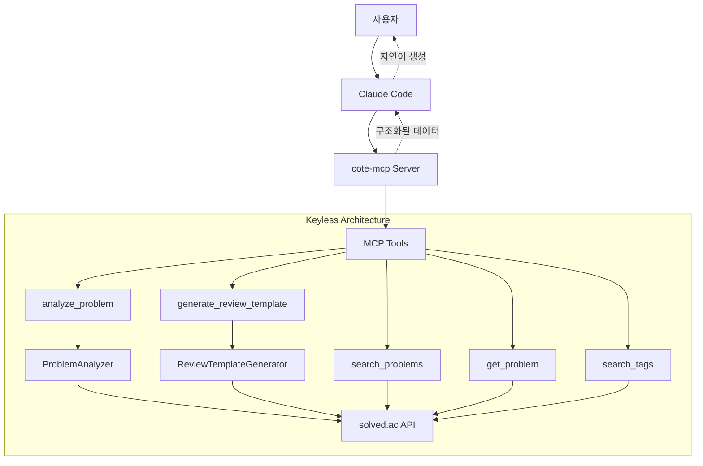
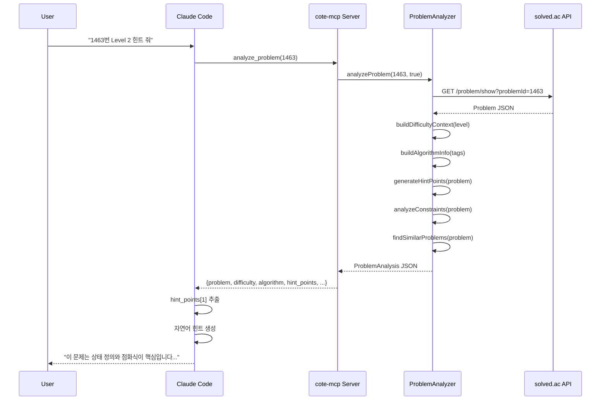
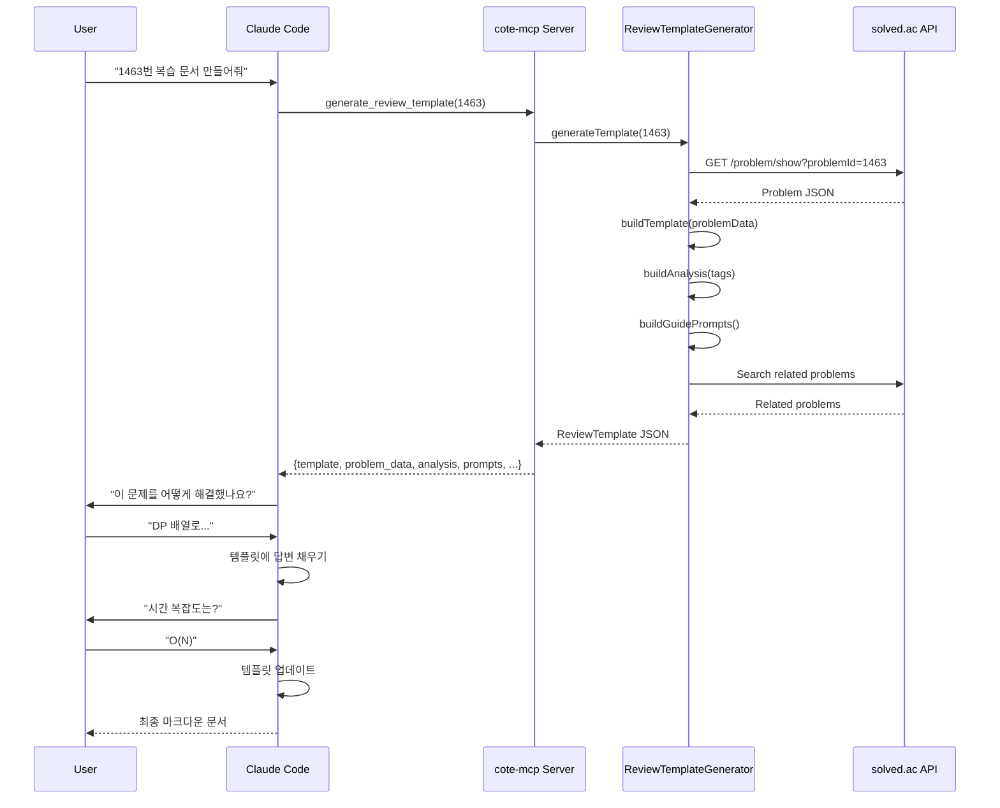

# Keyless 아키텍처 다이어그램

**Phase 3 업데이트**: 2026-02-13

---

## 시스템 구조 (Mermaid)



---

## 데이터 플로우

### 플로우 A: analyze_problem (힌트 생성)



### 플로우 B: generate_review_template (복습 문서)



---

## Keyless 아키텍처 특징

### 1. 역할 분리

| 컴포넌트 | 역할 | 특징 |
|----------|------|------|
| **cote-mcp Server** | 구조화된 데이터 제공 | 결정적(Deterministic), API 키 불필요 |
| **Claude Code** | 자연어 생성 | 맥락에 맞는 자연스러운 응답 |

### 2. 데이터 vs. 자연어

**기존 (Claude API 통합)**:
```
User → MCP → HintGenerator → Claude API → 자연어 힌트
```
- 문제점: API 키 필수, 테스트 어려움, 응답 시간 증가

**Keyless (Phase 3)**:
```
User → Claude Code → MCP → ProblemAnalyzer → JSON 데이터
                   ← JSON → 자연어 변환 ← Claude Code
```
- 장점: API 키 불필요, 테스트 안정성, 빠른 응답 (< 500ms)

### 3. 힌트 패턴 데이터

```typescript
// src/services/problem-analyzer.ts
const HINT_PATTERNS = {
  dp: {
    level1: {
      type: 'pattern',
      key: '동적 프로그래밍 (DP)',
      description: '큰 문제를 작은 부분 문제로 나누어 해결...',
      pitfalls: ['그리디 접근 주의', ...]
    },
    level2: {
      type: 'insight',
      key: '상태 정의와 점화식',
      description: 'dp[i] = ...',
      pitfalls: ['초기화 실수', ...]
    },
    level3: {
      type: 'strategy',
      key: 'Bottom-up 구현',
      description: '1부터 N까지 순차적으로...',
      steps: ['1. 초기화', '2. 반복문', ...]
    }
  },
  // 30개 이상의 알고리즘 패턴
};
```

---

## 이점

### 1. 사용자 경험
- ✅ API 키 설정 불필요
- ✅ 즉시 사용 가능 (Zero Configuration)
- ✅ 빠른 응답 속도 (< 500ms)

### 2. 개발 효율
- ✅ 테스트 안정성 (결정적 출력)
- ✅ Mock 불필요 (LLM 호출 없음)
- ✅ 디버깅 용이 (JSON 출력 검증)

### 3. 유지보수
- ✅ 힌트 패턴 수정이 코드 레벨에서 가능
- ✅ 버전 관리 용이 (Git으로 추적)
- ✅ 확장성 (새로운 알고리즘 패턴 추가 간편)

---

**작성자**: technical-writer
**검토자**: fullstack-developer, project-planner
