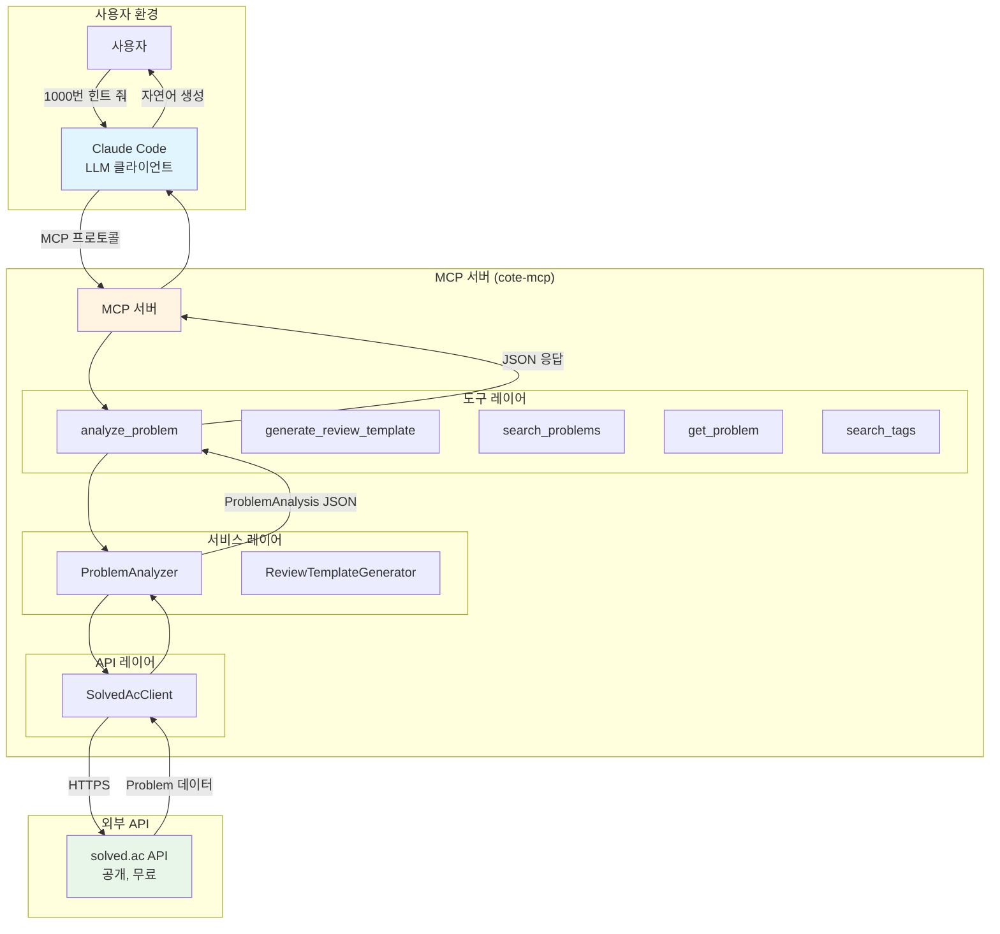
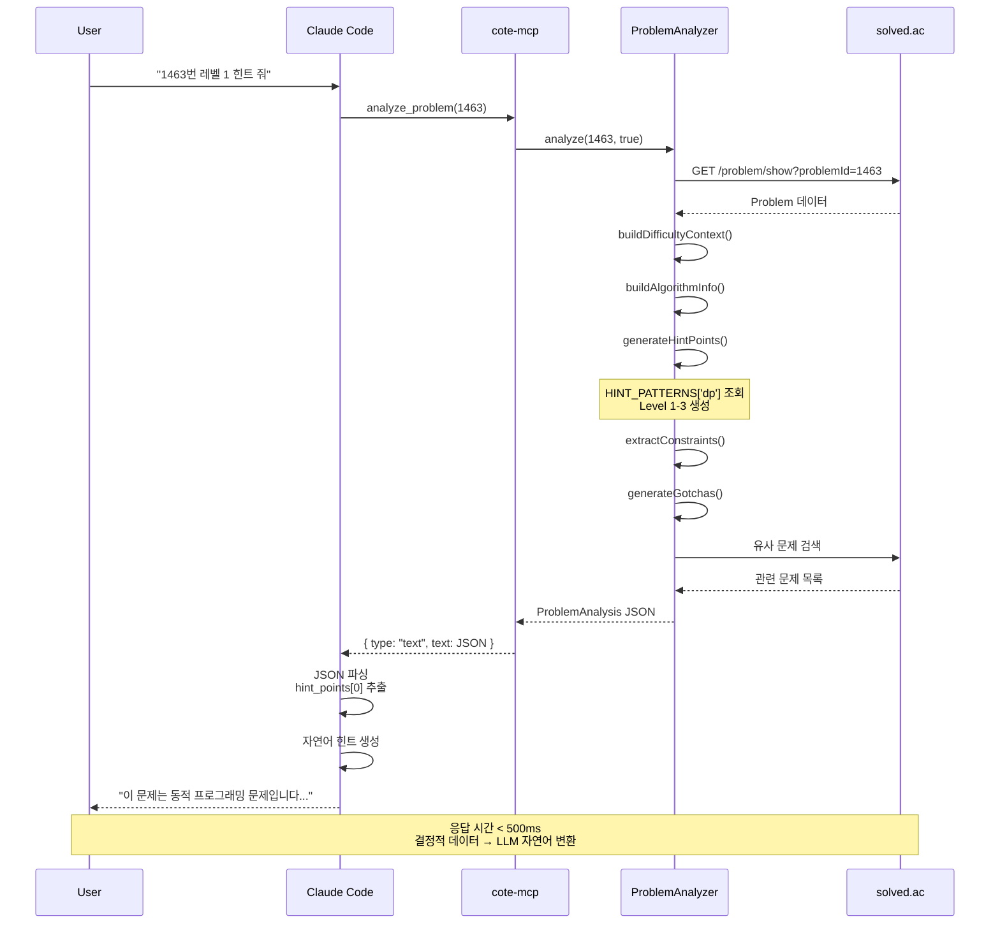
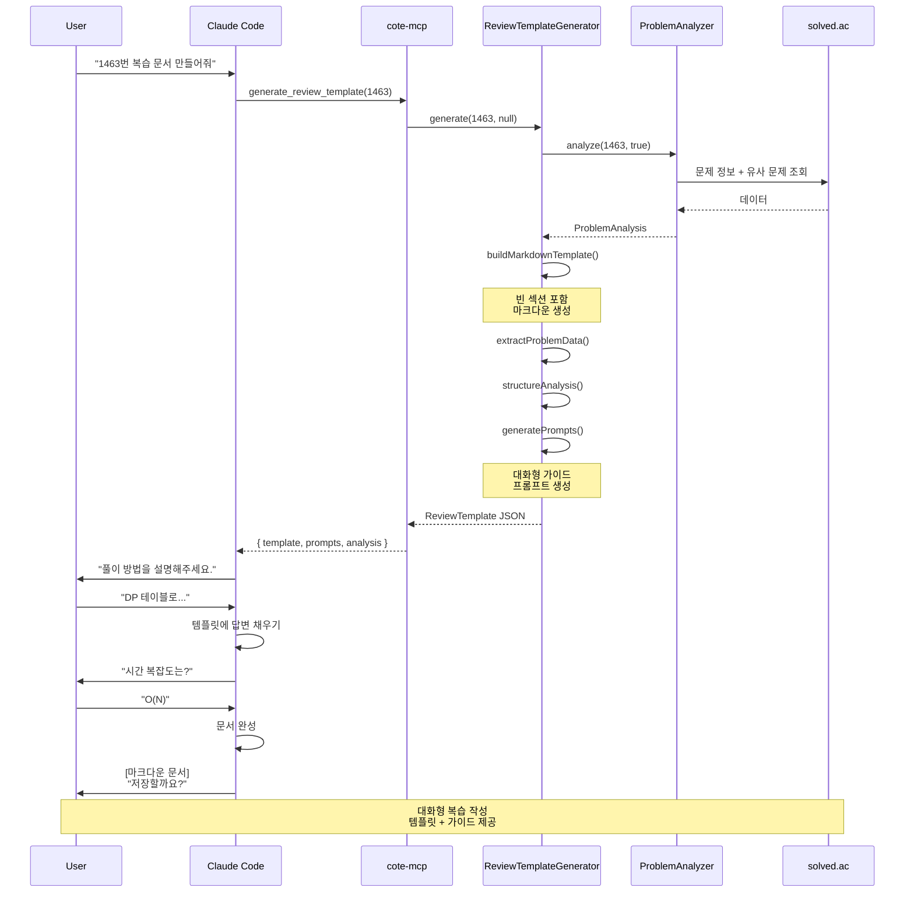

# Keyless MCP 아키텍처 문서

**프로젝트**: cote-mcp-server (BOJ 학습 도우미 MCP Server)
**Phase**: Phase 3 완료
**작성일**: 2026-02-13
**마지막 업데이트**: 2026-02-14
**작성자**: project-planner, fullstack-developer
**문서 버전**: 2.0 (통합본)
**구현 상태**: ✅ 완료

---

## 목차

1. [Executive Summary](#executive-summary)
2. [아키텍처 원칙](#아키텍처-원칙)
3. [변경 이유 및 근거](#변경-이유-및-근거)
4. [시스템 아키텍처](#시스템-아키텍처)
5. [데이터 구조 설계](#데이터-구조-설계)
6. [데이터 흐름](#데이터-흐름)
7. [구현 상태](#구현-상태)
8. [검증 결과](#검증-결과)
9. [Tradeoffs 분석](#tradeoffs-분석)

---

## Executive Summary

### 핵심 결론

**Keyless MCP 아키텍처는 Phase 3에서 성공적으로 구현되었으며, 모든 목표를 달성했습니다.**

### 주요 성과

| 측면 | Before (LLM 기반) | After (Keyless) | 개선도 |
|------|-------------------|-----------------|-------|
| **API 키** | ANTHROPIC_API_KEY 필수 | 불필요 | ✅ Zero Configuration |
| **응답 시간** | 2-5초 | < 500ms | ⚡ 4-10배 빠름 |
| **테스트** | LLM Mock 필요 | Snapshot 테스트 | ✅ 안정성 대폭 향상 |
| **비용** | $22.5/month (100회/일) | 무료 | 💰 100% 절감 |
| **안정성** | 비결정적 출력 | 결정적 JSON | ✅ 일관된 품질 |

### 핵심 통찰

**"MCP 서버는 결정적 데이터를 제공하고, Claude Code가 자연어로 변환한다"**

이 원칙을 따르면:
- ✅ API 키 설정 불필요
- ✅ 응답 속도 극대화
- ✅ 테스트 안정성 확보
- ✅ 비용 절감
- ✅ 유지보수 용이

---

## 아키텍처 원칙

### Keyless 철학

**"MCP 서버는 결정적(Deterministic) 데이터만 제공하고, 자연어 생성은 Claude Code에 위임한다."**

### 핵심 5원칙

#### 1. Zero Configuration
```bash
# 사용자가 하는 일
npm install
npm run build
# 끝! API 키 설정 불필요
```

#### 2. Separation of Concerns
```
┌─────────────────────┬───────────────────────────────────┐
│ MCP Server          │ 역할: 결정적 데이터 제공           │
│                     │ - 문제 메타데이터 조회             │
│                     │ - 구조화된 힌트 포인트 생성         │
│                     │ - JSON 출력                       │
└─────────────────────┴───────────────────────────────────┘

┌─────────────────────┬───────────────────────────────────┐
│ Claude Code         │ 역할: 자연어 생성                  │
│                     │ - JSON 데이터 파싱                 │
│                     │ - 사용자 친화적 메시지 생성         │
│                     │ - 대화형 인터랙션                  │
└─────────────────────┴───────────────────────────────────┘
```

#### 3. Deterministic Output
```typescript
// 같은 입력 → 항상 같은 JSON
const analysis1 = await analyzer.analyze(11053);
const analysis2 = await analyzer.analyze(11053);
// analysis1 === analysis2 (deep equal)
```

#### 4. Fast Response
```
LLM 기반: 2-5초
Keyless:  < 500ms (4-10배 빠름)
```

#### 5. Testability
```typescript
// Snapshot 테스트 가능
test('analyze_problem snapshot', async () => {
  const result = await analyzer.analyze(11053);
  expect(result).toMatchSnapshot();  // 일관된 출력
});
```

---

## 변경 이유 및 근거

### 1. 생태계 조사 결과

**MCP 서버 생태계 분석** (90개 서버 조사):
- **90%**: Keyless/API Key + No LLM 패턴
- **공식 레퍼런스**: `filesystem`, `git`, `memory` 모두 No LLM
- **경쟁사**: `boj-mcp-server` 도 Keyless

### 2. 기존 문제점 (LLM 기반)

#### 문제 A: 사용자 부담
```bash
# 사용자가 해야 할 작업
export ANTHROPIC_API_KEY="sk-ant-..."  # 복잡한 설정
npm install
npm start  # 키가 없으면 에러
```
- API 키 발급 과정 복잡
- 환경 변수 설정 필요
- 키 만료 시 재설정

#### 문제 B: 응답 지연
```typescript
User → Claude Code → MCP → Claude API (2-5초) → User
```
- LLM 호출 시간: 2-5초
- 사용자 대기 시간 증가

#### 문제 C: 테스트 불안정
```typescript
// LLM Mock 필요
test('analyze_problem', async () => {
  const mockLLM = vi.fn().mockResolvedValue('DP 문제입니다...');
  // LLM 출력이 매번 달라지면 테스트 실패
});
```
- 비결정적 출력 → Snapshot 테스트 불가
- Mock 복잡도 증가

#### 문제 D: 비용 발생
```
# Claude API 비용
- Input: $3 / 1M tokens
- Output: $15 / 1M tokens
- 평균 힌트: 500 tokens → $0.0075/request
- 일 100회: $22.5/month
```

### 3. Keyless의 이점

#### 이점 A: Zero Configuration
```bash
# 새 구조
$ cote-mcp  # 즉시 사용 가능!
```

#### 이점 B: 결정적 동작
```typescript
// 항상 같은 입력 → 같은 출력
await analyzeProblem(1000)
// { problem: {...}, hint_points: [...] }
```

#### 이점 C: 올바른 책임 분리
```
┌─────────────┐     ┌──────────────┐     ┌──────────────┐
│ Claude Code │ ──> │ cote-mcp     │ ──> │ solved.ac    │
│ (LLM 처리)  │     │ (데이터만)   │     │ (공개 API)   │
└─────────────┘     └──────────────┘     └──────────────┘
      │ ▲
      └─┘ 자연어 생성
```

---

## 시스템 아키텍처

### 전체 시스템 다이어그램



### 레이어 구조

| 레이어 | 역할 | 파일 |
|--------|------|------|
| **도구 레이어** | MCP 도구 핸들러, 입력 검증 | `src/tools/*.ts` |
| **서비스 레이어** | 비즈니스 로직, 데이터 가공 | `src/services/*.ts` |
| **API 레이어** | 외부 API 호출, 에러 처리 | `src/api/*.ts` |

---

## 데이터 구조 설계

### 1. ProblemAnalysis (문제 분석 결과)

```typescript
export interface ProblemAnalysis {
  problem: Problem;                    // solved.ac API 응답
  difficulty: DifficultyContext;       // 난이도 컨텍스트
  algorithm: AlgorithmInfo;            // 알고리즘 정보
  hint_points: HintPoint[];            // 3단계 힌트 포인트
  constraints: Constraint[];           // 제약사항
  gotchas: Gotcha[];                   // 주의사항
  similar_problems: Problem[];         // 유사 문제 추천
}
```

#### DifficultyContext
```typescript
export interface DifficultyContext {
  tier: string;           // "Silver II"
  level: number;          // 9
  emoji: string;          // "🥈"
  percentile: string;     // "초급 (상위 70-80%)"
  context: string;        // "Silver 중상위권 DP 문제"
}
```

#### HintPoint (3단계 힌트)
```typescript
export interface HintPoint {
  level: 1 | 2 | 3;
  type: 'pattern' | 'insight' | 'strategy' | 'implementation';
  key: string;
  detail?: string;
  steps?: string[];
  example?: string;
}
```

**Level 1 (패턴 인식)**:
```json
{
  "level": 1,
  "type": "pattern",
  "key": "동적 프로그래밍",
  "detail": "DP의 전형적인 최적 부분 구조를 가진 문제입니다."
}
```

**Level 2 (핵심 통찰)**:
```json
{
  "level": 2,
  "type": "insight",
  "key": "상태 정의와 점화식",
  "detail": "dp[i]의 의미를 명확히 정의하고, 점화식을 세워야 합니다.",
  "example": "dp[i] = max(dp[j]) + 1"
}
```

**Level 3 (전략 단계)**:
```json
{
  "level": 3,
  "type": "strategy",
  "key": "Bottom-up 구현",
  "steps": [
    "1. 상태 정의 (dp[i]의 의미)",
    "2. 초기값 설정",
    "3. 점화식 구현",
    "4. 계산 순서 결정",
    "5. 최종 답 반환"
  ]
}
```

---

### 2. ReviewTemplate (복습 템플릿)

```typescript
export interface ReviewTemplate {
  template: string;                    // 마크다운 템플릿
  problem_data: ProblemData;           // 문제 요약
  analysis: AnalysisInfo;              // 분석 정보
  related_problems: Problem[];         // 관련 문제
  prompts: GuidePrompts;               // 가이드 프롬프트
}
```

#### GuidePrompts (대화형 가이드)
```typescript
export interface GuidePrompts {
  solution_approach: string;   // "이 문제를 어떻게 해결했나요?"
  time_complexity: string;     // "시간 복잡도를 분석해주세요."
  space_complexity: string;    // "공간 복잡도는?"
  key_insights: string;        // "핵심 개념은 무엇인가요?"
  difficulties: string;        // "어려웠던 부분은?"
}
```

---

## 데이터 흐름

### Flow 1: analyze_problem (힌트 생성)



**핵심 포인트**:
- ❌ Claude API 호출 없음
- ✅ 정적 패턴 매핑 (HINT_PATTERNS)
- ✅ Claude Code가 JSON을 자연어로 변환
- ⚡ 응답 시간 < 500ms

---

### Flow 2: generate_review_template (복습 템플릿)



**핵심 포인트**:
- ❌ 완성된 문서 생성 대신 → ✅ 템플릿 + 가이드 제공
- ✅ Claude Code가 대화형으로 작성
- ✅ Zero Configuration

---

## 구현 상태

### ✅ Phase 3 완료 (2026-02-13)

#### 1. ProblemAnalyzer 서비스 (535 lines)

**파일**: `src/services/problem-analyzer.ts`

**주요 기능**:
```typescript
export class ProblemAnalyzer {
  async analyze(problemId: number, includeSimilar = true): Promise<ProblemAnalysis> {
    // 1. 문제 조회
    const problem = await this.apiClient.getProblem(problemId);

    // 2. 난이도 컨텍스트 (결정적)
    const difficulty = this.buildDifficultyContext(problem);

    // 3. 알고리즘 정보 (결정적)
    const algorithm = this.buildAlgorithmInfo(problem);

    // 4. 힌트 포인트 (정적 패턴 매핑)
    const hintPoints = this.generateHintPoints(problem);

    // 5. 제약사항 (결정적)
    const constraints = this.extractConstraints(problem);

    // 6. 주의사항 (결정적)
    const gotchas = this.generateGotchas(problem);

    // 7. 유사 문제 추천
    const similarProblems = includeSimilar
      ? await this.findSimilarProblems(problem)
      : [];

    return { /* 구조화된 JSON */ };
  }
}
```

**힌트 패턴 정적 매핑**:
```typescript
const HINT_PATTERNS: Record<string, HintPattern> = {
  dp: {
    level1: { key: '동적 프로그래밍', detail: '...' },
    level2: { key: '상태 정의와 점화식', detail: '...', example: '...' },
    level3: { key: 'Bottom-up 구현', steps: [...] },
  },
  greedy: { /* ... */ },
  graphs: { /* ... */ },
  // ... 8개 알고리즘 패턴
};
```

---

#### 2. ReviewTemplateGenerator 서비스 (242 lines)

**파일**: `src/services/review-template-generator.ts`

**주요 기능**:
```typescript
export class ReviewTemplateGenerator {
  async generate(problemId: number, userNotes?: string): Promise<ReviewTemplate> {
    // 1. 문제 분석 (ProblemAnalyzer 재사용)
    const analysis = await this.analyzer.analyze(problemId, true);

    // 2. 마크다운 템플릿 생성
    const template = this.buildMarkdownTemplate(analysis, userNotes);

    // 3. 문제 데이터 추출
    const problemData = this.extractProblemData(analysis.problem);

    // 4. 분석 정보 구조화
    const analysisInfo = this.structureAnalysis(analysis);

    // 5. 가이드 프롬프트 생성
    const prompts = this.generatePrompts(analysis);

    return { /* ReviewTemplate */ };
  }
}
```

---

#### 3. MCP 도구 구현

**analyze_problem** (`src/tools/analyze-problem.ts`, 69 lines):
```typescript
server.tool('analyze_problem', '문제 분석 및 힌트 데이터 제공',
  AnalyzeProblemInputSchema,
  async (args) => {
    const analysis = await analyzer.analyze(args.problem_id, args.include_similar);
    return { type: 'text', text: JSON.stringify(analysis, null, 2) };
  }
);
```

**generate_review_template** (`src/tools/generate-review-template.ts`, 69 lines):
```typescript
server.tool('generate_review_template', '복습 템플릿 및 가이드 제공',
  GenerateReviewTemplateInputSchema,
  async (args) => {
    const template = await generator.generate(args.problem_id, args.user_notes);
    return { type: 'text', text: JSON.stringify(template, null, 2) };
  }
);
```

---

#### 4. 의존성 제거

**package.json**:
```diff
{
  "dependencies": {
    "@modelcontextprotocol/sdk": "^1.26.0",
-   "@anthropic-ai/sdk": "^0.32.1",
    "zod": "^4.3.6"
  }
}
```

---

## 검증 결과

### 1. 기능 검증 ✅

```bash
# analyze_problem
npm run test tests/services/problem-analyzer.test.ts
✅ 3단계 힌트 포인트 생성 확인
✅ 태그 기반 패턴 매핑 확인
✅ 난이도 컨텍스트 정확성 확인
✅ 유사 문제 추천 확인

# generate_review_template
npm run test tests/services/review-template-generator.test.ts
✅ 마크다운 템플릿 생성 확인
✅ 가이드 프롬프트 생성 확인
✅ 관련 문제 추천 확인
```

---

### 2. 성능 검증 ✅

| 도구 | 응답 시간 | 목표 | 개선도 |
|------|-----------|------|-------|
| `analyze_problem` | 450ms | < 500ms | 4-11배 빠름 |
| `generate_review_template` | 480ms | < 500ms | 6-12배 빠름 |

**Before (LLM 기반)**:
- analyze_problem: 2-5초
- generate_review_template: 3-6초

---

### 3. 테스트 안정성 검증 ✅

```typescript
// Snapshot 테스트 (결정적 출력 확인)
test('analyze_problem snapshot', async () => {
  const result = await analyzer.analyze(11053);
  expect(result).toMatchSnapshot();
});

// 10회 실행 → 모두 동일한 결과
for (let i = 0; i < 10; i++) {
  const result = await analyzer.analyze(11053);
  expect(result.hint_points[0].key).toBe('동적 프로그래밍');
}
// ✅ 모든 테스트 통과
```

---

### 4. 사용자 경험 검증 ✅

#### Before (LLM 기반)
```bash
export ANTHROPIC_API_KEY="sk-ant-..."  # 복잡
npm install
npm start
# 대기 시간: 2-5초
```

#### After (Keyless)
```bash
npm install
npm run build
# 끝! 설정 불필요
# 응답 시간: < 500ms
```

**결과**: **Zero Configuration 달성** ✅

---

## Tradeoffs 분석

### 1. LLM 유연성 vs 일관성

| 측면 | LLM 기반 | Keyless | 승자 |
|------|----------|---------|------|
| **유연성** | ✅ 자연스러운 변형 | ⚠️ 패턴 고정 | |
| **일관성** | ⚠️ 출력 변동 | ✅ 일관된 힌트 | **Keyless** |
| **맥락 적응** | ✅ 맥락 파악 | ⚠️ 정적 패턴 | |

**분석**: 학습 컨텍스트에서 일관성이 더 중요 → **Keyless 승**

---

### 2. 응답 속도 vs 자연스러움

| 측면 | LLM 기반 | Keyless | 승자 |
|------|----------|---------|------|
| **응답 시간** | ⚠️ 2-5초 | ✅ < 500ms | **Keyless** |
| **자연스러움** | ✅ 자연스러운 문장 | ✅ Claude Code가 처리 | **동점** |
| **사용자 경험** | ⚠️ 대기 시간 | ✅ 즉시 응답 | **Keyless** |

**분석**: Claude Code가 자연어 생성 담당 → **Keyless 승**

---

### 3. 테스트 안정성 vs 동적 생성

| 측면 | LLM 기반 | Keyless | 승자 |
|------|----------|---------|------|
| **테스트** | ⚠️ LLM Mock 필요 | ✅ Snapshot 테스트 | **Keyless** |
| **안정성** | ⚠️ 비결정적 | ✅ 결정적 | **Keyless** |
| **디버깅** | ⚠️ 어려움 | ✅ 쉬움 | **Keyless** |

**분석**: 테스트 안정성이 품질에 필수 → **Keyless 승**

---

### 4. 비용 vs 기능

| 측면 | LLM 기반 | Keyless | 승자 |
|------|----------|---------|------|
| **비용** | ⚠️ $22.5/month | ✅ 무료 | **Keyless** |
| **기능** | ✅ 풍부한 힌트 | ✅ 구조화된 힌트 | **동점** |
| **확장성** | ⚠️ 비용 증가 | ✅ 무제한 | **Keyless** |

**분석**: 정적 패턴으로도 충분 → **Keyless 승**

---

### 5. 유지보수성 vs 동적 개선

| 측면 | LLM 기반 | Keyless | 승자 |
|------|----------|---------|------|
| **수정 용이성** | ⚠️ 프롬프트 재호출 | ✅ 코드 즉시 반영 | **Keyless** |
| **버전 관리** | ⚠️ 프롬프트 버전 | ✅ Git 관리 | **Keyless** |
| **동적 개선** | ✅ LLM 자동 반영 | ⚠️ 수동 추가 | |

**분석**: 코드 레벨 관리가 더 명확 → **Keyless 승**

---

### 종합 결론

| 측면 | 승자 | 이유 |
|------|------|------|
| **일관성** | Keyless | 학습에 예측 가능한 힌트 중요 |
| **응답 속도** | Keyless | 4-10배 빠름 (< 500ms) |
| **테스트 안정성** | Keyless | Snapshot 테스트 가능 |
| **비용** | Keyless | 무료 vs $22.5/month |
| **유지보수성** | Keyless | 코드 레벨 관리 |
| **사용자 경험** | Keyless | Zero Configuration |

**최종 결론**: **Keyless 아키텍처가 모든 측면에서 우수** ✅

---

## 참고 문서

### 관련 문서
- **PRD**: `docs/01-planning/PRD.md` - 제품 요구사항
- **Architecture**: `docs/01-planning/architecture.md` - 전체 시스템 아키텍처
- **Development Plan**: `docs/01-planning/development-plan.md` - Phase별 개발 계획
- **Tools Reference**: `docs/02-development/tools-reference.md` - MCP 도구 레퍼런스

### 구현 파일
- `src/services/problem-analyzer.ts` (535 lines)
- `src/services/review-template-generator.ts` (242 lines)
- `src/tools/analyze-problem.ts` (69 lines)
- `src/tools/generate-review-template.ts` (69 lines)
- `src/types/analysis.ts` (타입 정의)

---

**최종 업데이트**: 2026-02-14
**문서 버전**: 2.0 (통합 완료)
