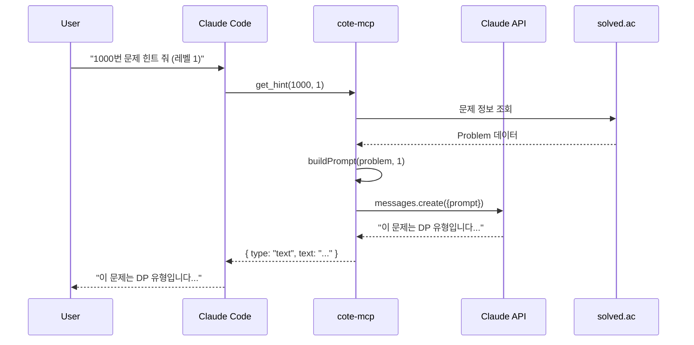
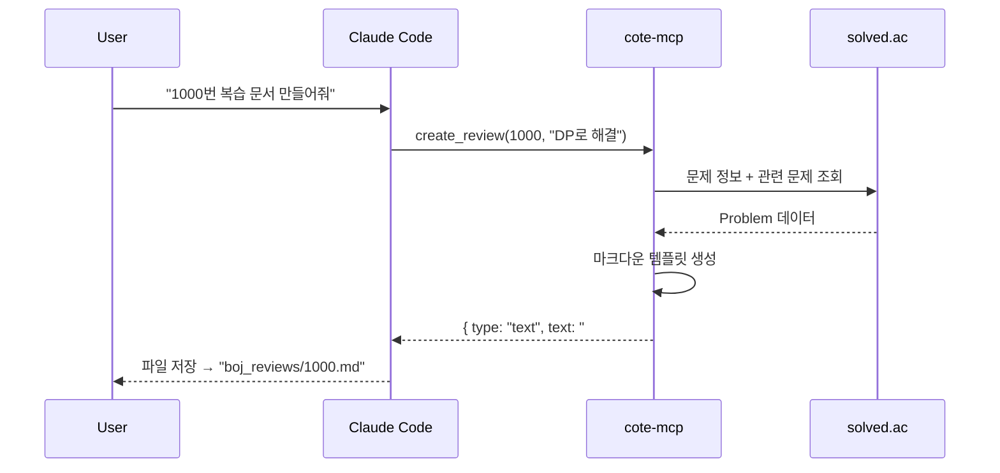
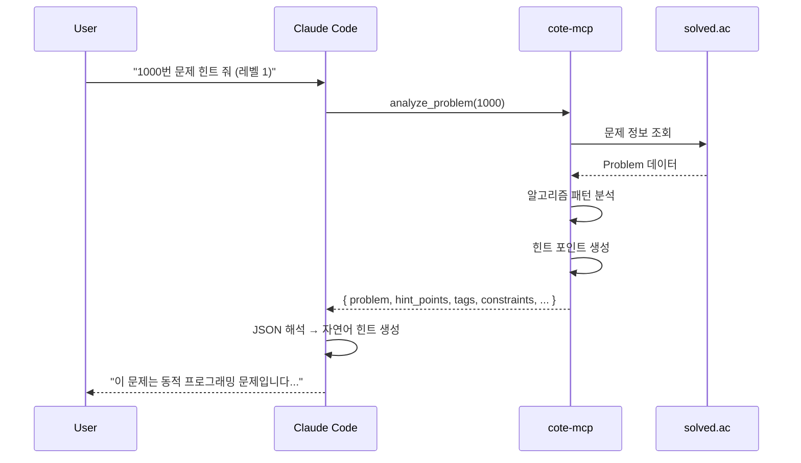
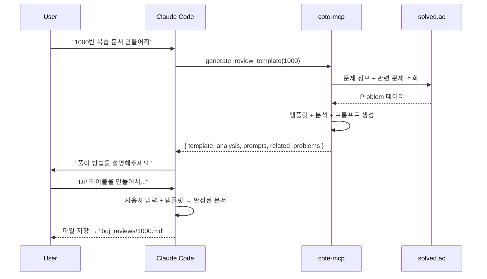
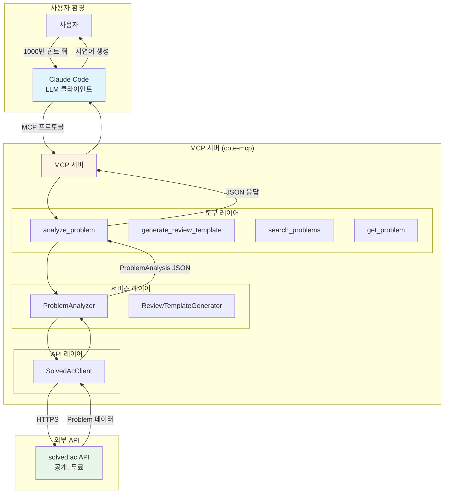
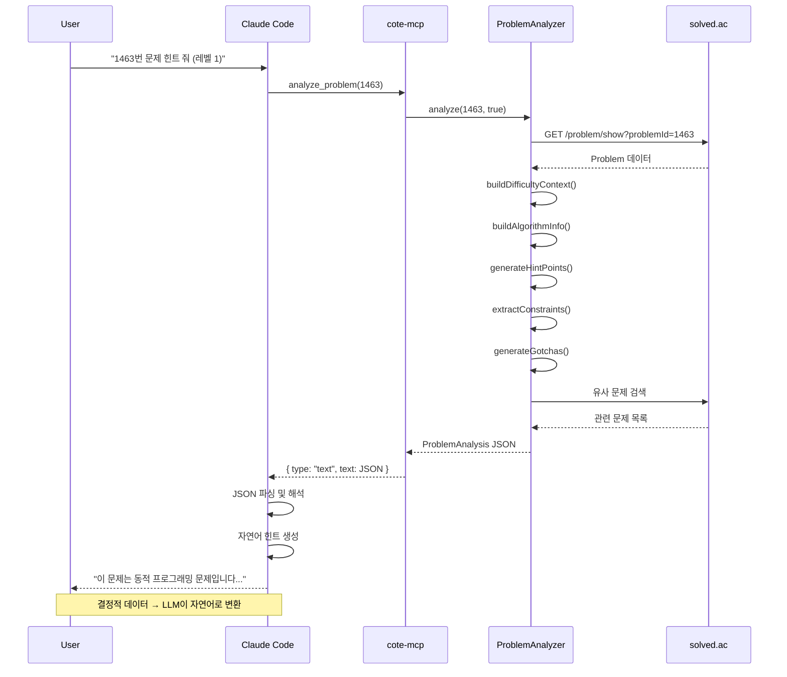
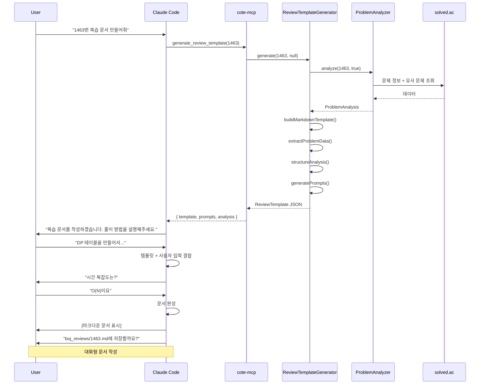

# Keyless 아키텍처 재설계: Phase 3 전환

**작성일**: 2026-02-13
**버전**: 1.0
**작성자**: project-planner

---

## 목차

1. [개요](#개요)
2. [변경 이유](#변경-이유)
3. [아키텍처 비교](#아키텍처-비교)
4. [새로운 설계](#새로운-설계)
5. [데이터 구조](#데이터-구조)
6. [마이그레이션 계획](#마이그레이션-계획)
7. [의존성 변경](#의존성-변경)
8. [구현 가이드](#구현-가이드)
9. [테스트 전략](#테스트-전략)
10. [부록](#부록)

---

## 1. 개요

### 1.1 변경 사항 요약

**Phase 3 구현 상태**:
- ✅ `get_hint`: Claude API 기반 3단계 힌트 생성
- ✅ `create_review`: 템플릿 기반 복습 문서 생성
- ⚠️ **문제점**: `ANTHROPIC_API_KEY` 필요 (사용자 부담)

**새로운 설계**:
- 🔄 `analyze_problem`: 구조화된 힌트 데이터 제공 (Keyless)
- 🔄 `generate_review_template`: 복습 템플릿 + 가이드 제공 (Keyless)
- ✅ Claude Code가 데이터를 받아서 자연어 생성

### 1.2 핵심 원칙

**MCP 생태계 Best Practice (90% 서버 적용)**:
> "MCP 서버는 결정적(deterministic) 데이터를 제공하고,
> LLM 호출은 클라이언트(Claude Code)가 담당한다."

---

## 2. 변경 이유

### 2.1 생태계 조사 결과

**보고서 출처**: `/stash/reports/20260213_mcp_server_ecosystem_analysis.md`

**핵심 발견**:
- 90%의 MCP 서버: **Keyless/API Key + No LLM** 패턴
- 공식 레퍼런스 서버 (`filesystem`, `git`, `memory`): 모두 No LLM
- 경쟁사 `boj-mcp-server`: Keyless + No LLM
- Claude Code/Codex: 이미 LLM 접근 가능

### 2.2 현재 문제점

#### A. 사용자 부담 증가
```bash
# 현재 구조 (Phase 3)
$ export ANTHROPIC_API_KEY="sk-..."
$ cote-mcp
```
- API 키 발급 필요
- 사용 비용 발생 (사용자 부담)
- 설정 복잡도 증가

#### B. 비결정적 동작
```typescript
// 같은 입력, 다른 출력
await getHint(1000, 1) // "동적 프로그래밍을 사용하세요"
await getHint(1000, 1) // "DP 테이블을 정의하세요" (다름!)
```
- 캐싱 불가
- 테스트 어려움 (flaky tests)
- 디버깅 복잡

#### C. 아키텍처 안티패턴
```
┌─────────────┐     ┌──────────────┐     ┌──────────────┐
│ Claude Code │ ──> │ cote-mcp     │ ──> │ Claude API   │
│ (LLM 보유)  │     │ (LLM 호출!)  │     │ (중복 LLM)   │
└─────────────┘     └──────────────┘     └──────────────┘
```
- **불필요한 중복**: Claude Code가 이미 LLM 접근 가능
- **비용 낭비**: 서버가 LLM API 호출
- **복잡도 증가**: 프롬프트 엔지니어링 서버에 내장

### 2.3 새로운 접근법의 이점

#### A. Zero Configuration
```bash
# 새 구조
$ cote-mcp  # 바로 실행 가능!
```
- API 키 불필요
- 즉시 사용 가능
- 사용자 친화적

#### B. 결정적 동작
```typescript
// 항상 같은 입력 → 같은 출력
await analyzeProblem(1000)
// { problem: {...}, hint_points: [...], tags: [...] }
```
- 캐싱 가능
- 테스트 안정적
- 디버깅 용이

#### C. 올바른 책임 분리
```
┌─────────────┐     ┌──────────────┐     ┌──────────────┐
│ Claude Code │ ──> │ cote-mcp     │ ──> │ solved.ac    │
│ (LLM 처리)  │     │ (데이터만)   │     │ (공개 API)   │
└─────────────┘     └──────────────┘     └──────────────┘
       │ ▲
       └─┘ 자연어 생성
```
- **명확한 역할**: 서버는 데이터, 클라이언트는 LLM
- **비용 효율**: API 호출 없음
- **단순성**: 프롬프트 로직 제거

---

## 3. 아키텍처 비교

### 3.1 기존 아키텍처 (Phase 3 구현)

#### 힌트 시스템 (API Key Required)



**문제점**:
- 🔴 `ANTHROPIC_API_KEY` 필요
- 🔴 비결정적 출력 (캐싱 불가)
- 🔴 API 비용 발생
- 🔴 테스트 복잡 (mock 필요)

#### 복습 시스템 (Template Based)



**문제점**:
- ⚠️ 정적 템플릿 (사용자 맞춤 부족)
- ⚠️ Claude Code가 추가 가이드 제공 못함

---

### 3.2 새로운 아키텍처 (Keyless + No LLM)

#### 힌트 시스템 (Keyless)



**개선점**:
- ✅ API 키 불필요
- ✅ 결정적 출력 (캐싱 가능)
- ✅ 비용 없음
- ✅ 테스트 간단 (JSON 검증)

#### 복습 시스템 (Enhanced Template)



**개선점**:
- ✅ 대화형 복습 작성
- ✅ 사용자 맞춤 가이드
- ✅ Claude Code가 자연스럽게 대화

---

## 4. 새로운 설계

### 4.1 도구 재설계

#### A. `analyze_problem` (기존 `get_hint` 대체)

**목적**: 문제 분석 데이터를 구조화하여 제공

**입력 스키마**:
```typescript
const AnalyzeProblemInputSchema = z.object({
  problem_id: z.number().int().positive()
    .describe('백준 문제 번호'),
  include_similar: z.boolean().optional().default(true)
    .describe('유사 문제 추천 포함 여부'),
});
```

**출력 구조**:
```typescript
interface ProblemAnalysis {
  // 기본 문제 정보
  problem: Problem;

  // 난이도 컨텍스트
  difficulty: {
    tier: string;           // "Silver II"
    level: number;          // 9
    emoji: string;          // "🥈"
    percentile: string;     // "상위 30-40%"
    context: string;        // "Silver 중상위권 DP 문제"
  };

  // 알고리즘 정보
  algorithm: {
    primary_tags: string[];           // ["동적 프로그래밍", "그리디"]
    tag_explanations: Record<string, string>;  // { "dp": "최적 부분 구조..." }
    typical_approaches: string[];     // ["Top-down DP", "Bottom-up DP"]
    time_complexity_typical: string;  // "O(N)"
    space_complexity_typical: string; // "O(N)"
  };

  // 3단계 힌트 포인트
  hint_points: HintPoint[];

  // 주의사항
  constraints: Constraint[];
  gotchas: Gotcha[];

  // 유사 문제
  similar_problems: Problem[];

  // (선택) 프롬프트 템플릿
  prompt_template?: string;
}
```

**힌트 포인트 구조**:
```typescript
interface HintPoint {
  level: 1 | 2 | 3;
  type: 'pattern' | 'insight' | 'strategy' | 'implementation';
  key: string;         // "동적 프로그래밍"
  detail?: string;     // "DP 테이블 정의: dp[i] = i번째까지의 최솟값"
  steps?: string[];    // ["1. 상태 정의", "2. 점화식", "3. 초기값"]
  example?: string;    // "dp[0] = 0, dp[1] = arr[0]"
}
```

**예시 응답** (1000번 A+B 문제):
```json
{
  "problem": {
    "problemId": 1000,
    "titleKo": "A+B",
    "level": 1,
    "tags": [{"key": "implementation", "displayNames": [{"language": "ko", "name": "구현"}]}]
  },
  "difficulty": {
    "tier": "Bronze V",
    "level": 1,
    "emoji": "🥉",
    "percentile": "입문",
    "context": "Bronze V 입문 문제"
  },
  "algorithm": {
    "primary_tags": ["구현", "사칙연산"],
    "tag_explanations": {
      "implementation": "알고리즘 없이 문제 조건을 그대로 구현",
      "math": "기본적인 수학 연산"
    },
    "typical_approaches": ["직접 계산"],
    "time_complexity_typical": "O(1)",
    "space_complexity_typical": "O(1)"
  },
  "hint_points": [
    {
      "level": 1,
      "type": "pattern",
      "key": "입출력 문제",
      "detail": "두 정수를 입력받아 합을 출력하는 기본 입출력 문제입니다."
    },
    {
      "level": 2,
      "type": "insight",
      "key": "언어별 입출력 방법",
      "detail": "각 언어의 표준 입출력 함수를 사용하세요.",
      "example": "Python: input(), C++: cin, Java: Scanner"
    },
    {
      "level": 3,
      "type": "strategy",
      "key": "구현 단계",
      "steps": [
        "1. 두 정수 A, B 입력",
        "2. A + B 계산",
        "3. 결과 출력"
      ]
    }
  ],
  "constraints": [
    {
      "type": "input_range",
      "description": "-1,000 ≤ A, B ≤ 1,000",
      "importance": "low"
    }
  ],
  "gotchas": [
    {
      "description": "입출력 형식 주의 (공백으로 구분)",
      "severity": "low"
    }
  ],
  "similar_problems": [
    {"problemId": 1001, "titleKo": "A-B", "level": 1}
  ]
}
```

**Claude Code 활용 예시**:
```
User: "1000번 문제 레벨 1 힌트 줘"

Claude Code → analyze_problem(1000)
← ProblemAnalysis JSON

Claude Code 생성:
"이 문제는 **Bronze V 입문 문제**로, 기본적인 입출력을 연습하는 문제입니다.

**힌트 레벨 1: 문제 유형**
- 두 정수를 입력받아 합을 출력하는 기본 입출력 문제입니다.
- 알고리즘이 필요 없고, 언어의 기본 입출력 기능만 사용하면 됩니다.

**관련 태그**: 구현, 사칙연산

다음 힌트가 필요하면 말씀해주세요!"
```

---

#### B. `generate_review_template` (기존 `create_review` 개선)

**목적**: 복습 템플릿 + 가이드를 제공하여 Claude Code가 대화형으로 문서 완성

**입력 스키마**:
```typescript
const GenerateReviewTemplateInputSchema = z.object({
  problem_id: z.number().int().positive()
    .describe('백준 문제 번호'),
  user_notes: z.string().optional()
    .describe('사용자가 미리 작성한 메모 (선택)'),
});
```

**출력 구조**:
```typescript
interface ReviewTemplate {
  // 마크다운 템플릿
  template: string;

  // 문제 데이터
  problem_data: {
    id: number;
    title: string;
    tier: string;
    tags: string[];
    stats: {
      acceptedUserCount: number;
      averageTries: number;
    };
  };

  // 분석 정보
  analysis: {
    tags_explanation: Record<string, string>;
    difficulty_context: string;
    common_approaches: string[];
    time_complexity_typical: string;
    space_complexity_typical: string;
    common_mistakes: string[];
  };

  // 관련 문제
  related_problems: Problem[];

  // 가이드 프롬프트
  prompts: {
    solution_approach: string;
    time_complexity: string;
    space_complexity: string;
    key_insights: string;
    difficulties: string;
  };
}
```

**예시 응답**:
```json
{
  "template": "# 1000. A+B\n\n## 문제 정보\n\n**티어**: 🥉 Bronze V\n...",
  "problem_data": {
    "id": 1000,
    "title": "A+B",
    "tier": "Bronze V",
    "tags": ["구현", "사칙연산"],
    "stats": {
      "acceptedUserCount": 450000,
      "averageTries": 1.2
    }
  },
  "analysis": {
    "tags_explanation": {
      "implementation": "알고리즘 없이 조건을 그대로 구현",
      "math": "기본적인 수학 연산"
    },
    "difficulty_context": "입문자를 위한 첫 문제",
    "common_approaches": ["직접 계산"],
    "time_complexity_typical": "O(1)",
    "space_complexity_typical": "O(1)",
    "common_mistakes": ["입출력 형식 오류"]
  },
  "related_problems": [
    {"problemId": 1001, "titleKo": "A-B", "level": 1}
  ],
  "prompts": {
    "solution_approach": "이 문제를 어떻게 해결했나요? 입력을 받고 계산한 방법을 설명해주세요.",
    "time_complexity": "이 풀이의 시간 복잡도는 어떻게 되나요? 입력 크기에 따라 어떻게 변하나요?",
    "space_complexity": "추가로 사용한 메모리가 있나요? 공간 복잡도를 분석해보세요.",
    "key_insights": "이 문제에서 배운 점이나 주의할 점은 무엇인가요?",
    "difficulties": "문제를 풀면서 어려웠던 부분이 있었나요?"
  }
}
```

**Claude Code 활용 시나리오**:
```
User: "1000번 복습 문서 만들어줘"

Claude Code → generate_review_template(1000)
← ReviewTemplate JSON

Claude Code:
"복습 문서를 작성하겠습니다. 몇 가지 질문에 답해주세요.

1. 이 문제를 어떻게 해결했나요? 입력을 받고 계산한 방법을 설명해주세요."

User: "Python input()으로 입력받아서 split()으로 나누고 더했어요"

Claude Code:
"좋습니다! 이제 시간 복잡도를 생각해볼까요?
2. 이 풀이의 시간 복잡도는 어떻게 되나요?"

User: "O(1)이요"

...

Claude Code:
"복습 문서를 생성했습니다.
[생성된 마크다운 문서 표시]

boj_reviews/1000.md에 저장할까요?"
```

---

### 4.2 구현 파일 구조

#### 신규 서비스

**`src/services/problem-analyzer.ts`**:
```typescript
/**
 * ProblemAnalyzer 서비스
 *
 * 문제 분석 및 구조화된 힌트 데이터 생성
 */
export class ProblemAnalyzer {
  constructor(
    private apiClient: SolvedAcClient
  ) {}

  /**
   * 문제 분석 및 힌트 포인트 생성
   */
  async analyze(
    problemId: number,
    includeSimilar = true
  ): Promise<ProblemAnalysis> {
    // 1. 문제 정보 조회
    const problem = await this.apiClient.getProblem(problemId);

    // 2. 난이도 컨텍스트 생성
    const difficulty = this.buildDifficultyContext(problem);

    // 3. 알고리즘 정보 생성
    const algorithm = this.buildAlgorithmInfo(problem);

    // 4. 힌트 포인트 생성 (레벨 1-3)
    const hintPoints = this.generateHintPoints(problem);

    // 5. 제약사항 추출
    const constraints = this.extractConstraints(problem);

    // 6. 주의사항 생성
    const gotchas = this.generateGotchas(problem);

    // 7. 유사 문제 추천
    const similarProblems = includeSimilar
      ? await this.findSimilarProblems(problem)
      : [];

    return {
      problem,
      difficulty,
      algorithm,
      hint_points: hintPoints,
      constraints,
      gotchas,
      similar_problems: similarProblems,
    };
  }

  /**
   * 난이도 컨텍스트 빌드
   */
  private buildDifficultyContext(problem: Problem): DifficultyContext {
    // 티어 정보
    const tier = levelToTier(problem.level);
    const emoji = getTierEmoji(problem.level);

    // 난이도 백분위
    const percentile = this.calculatePercentile(problem.level);

    // 컨텍스트 문자열
    const context = this.generateDifficultyContext(problem.level, problem.tags);

    return { tier, level: problem.level, emoji, percentile, context };
  }

  /**
   * 알고리즘 정보 빌드
   */
  private buildAlgorithmInfo(problem: Problem): AlgorithmInfo {
    // 태그 이름 추출 (한글)
    const primaryTags = problem.tags.map(tag =>
      tag.displayNames.find(dn => dn.language === 'ko')?.name || tag.key
    );

    // 태그별 설명 (정적 매핑)
    const tagExplanations = this.getTagExplanations(problem.tags);

    // 일반적인 접근법
    const typicalApproaches = this.getTypicalApproaches(problem.tags);

    // 복잡도 추정
    const timeComplexity = this.estimateComplexity(problem);
    const spaceComplexity = this.estimateSpaceComplexity(problem);

    return {
      primary_tags: primaryTags,
      tag_explanations: tagExplanations,
      typical_approaches: typicalApproaches,
      time_complexity_typical: timeComplexity,
      space_complexity_typical: spaceComplexity,
    };
  }

  /**
   * 힌트 포인트 생성 (레벨 1-3)
   */
  private generateHintPoints(problem: Problem): HintPoint[] {
    const points: HintPoint[] = [];

    // 레벨 1: 패턴 인식
    points.push({
      level: 1,
      type: 'pattern',
      key: this.identifyPattern(problem.tags),
      detail: this.getPatternDetail(problem.tags),
    });

    // 레벨 2: 핵심 통찰
    points.push({
      level: 2,
      type: 'insight',
      key: this.getKeyInsight(problem.tags),
      detail: this.getInsightDetail(problem.tags),
      example: this.getInsightExample(problem.tags),
    });

    // 레벨 3: 전략 단계
    points.push({
      level: 3,
      type: 'strategy',
      key: this.getStrategyKey(problem.tags),
      steps: this.getStrategySteps(problem.tags),
    });

    return points;
  }

  /**
   * 패턴 식별 (태그 기반)
   */
  private identifyPattern(tags: ProblemTag[]): string {
    // 태그 우선순위 매핑
    const patternMap: Record<string, string> = {
      'dp': '동적 프로그래밍',
      'greedy': '그리디 알고리즘',
      'graphs': '그래프 탐색',
      'math': '수학',
      'implementation': '구현',
      'string': '문자열 처리',
      'data_structures': '자료구조',
      // ... 전체 태그 매핑
    };

    const primaryTag = tags[0]?.key || 'implementation';
    return patternMap[primaryTag] || '알고리즘 문제';
  }

  // ... 기타 헬퍼 메서드
}
```

**`src/services/review-template-generator.ts`**:
```typescript
/**
 * ReviewTemplateGenerator 서비스
 *
 * 복습 템플릿 및 가이드 생성
 */
export class ReviewTemplateGenerator {
  constructor(
    private apiClient: SolvedAcClient,
    private analyzer: ProblemAnalyzer
  ) {}

  /**
   * 복습 템플릿 생성
   */
  async generate(
    problemId: number,
    userNotes?: string
  ): Promise<ReviewTemplate> {
    // 1. 문제 분석 (ProblemAnalyzer 재사용)
    const analysis = await this.analyzer.analyze(problemId, true);

    // 2. 마크다운 템플릿 생성
    const template = this.buildMarkdownTemplate(analysis, userNotes);

    // 3. 문제 데이터 추출
    const problemData = this.extractProblemData(analysis.problem);

    // 4. 분석 정보 구조화
    const analysisInfo = this.structureAnalysis(analysis);

    // 5. 가이드 프롬프트 생성
    const prompts = this.generatePrompts(analysis);

    return {
      template,
      problem_data: problemData,
      analysis: analysisInfo,
      related_problems: analysis.similar_problems,
      prompts,
    };
  }

  /**
   * 마크다운 템플릿 빌드
   */
  private buildMarkdownTemplate(
    analysis: ProblemAnalysis,
    userNotes?: string
  ): string {
    const { problem, difficulty, algorithm } = analysis;

    let md = `# ${problem.problemId}. ${problem.titleKo}\n\n`;

    // 문제 정보
    md += `## 문제 정보\n\n`;
    md += `**티어**: ${difficulty.emoji} ${difficulty.tier}\n`;
    md += `**태그**: ${algorithm.primary_tags.join(', ')}\n`;
    md += `**링크**: [BOJ ${problem.problemId}](https://www.acmicpc.net/problem/${problem.problemId})\n\n`;

    // 사용자 메모 (있으면)
    if (userNotes) {
      md += `## 초기 메모\n\n${userNotes}\n\n`;
    }

    // 풀이 접근법 (빈 섹션)
    md += `## 풀이 접근법\n\n`;
    md += `[여기에 풀이 방법을 작성해주세요]\n\n`;

    // 복잡도 분석 (빈 섹션)
    md += `## 시간/공간 복잡도\n\n`;
    md += `- **시간 복잡도**: [작성 예정]\n`;
    md += `- **공간 복잡도**: [작성 예정]\n\n`;

    // 핵심 인사이트 (빈 섹션)
    md += `## 핵심 인사이트\n\n`;
    md += `[작성 예정]\n\n`;

    // 어려웠던 점 (빈 섹션)
    md += `## 어려웠던 점\n\n`;
    md += `[작성 예정]\n\n`;

    // 관련 문제 (자동 생성)
    md += `## 관련 문제\n\n`;
    if (analysis.similar_problems.length > 0) {
      analysis.similar_problems.forEach(p => {
        const tier = getTierBadge(p.level);
        md += `- [${p.problemId}. ${p.titleKo}](https://www.acmicpc.net/problem/${p.problemId}) (${tier})\n`;
      });
    } else {
      md += `관련 문제를 찾을 수 없습니다.\n`;
    }
    md += `\n`;

    // 해결 날짜
    const today = new Date().toISOString().split('T')[0];
    md += `## 해결 날짜\n\n`;
    md += `${today}\n`;

    return md;
  }

  /**
   * 가이드 프롬프트 생성
   */
  private generatePrompts(analysis: ProblemAnalysis): GuidePrompts {
    const { difficulty, algorithm } = analysis;

    return {
      solution_approach: this.buildSolutionPrompt(algorithm),
      time_complexity: this.buildComplexityPrompt(algorithm),
      space_complexity: this.buildSpacePrompt(algorithm),
      key_insights: this.buildInsightPrompt(difficulty, algorithm),
      difficulties: this.buildDifficultyPrompt(difficulty),
    };
  }

  private buildSolutionPrompt(algorithm: AlgorithmInfo): string {
    const primaryTag = algorithm.primary_tags[0];
    return `이 문제를 어떻게 해결했나요? ${primaryTag} 접근법을 사용했다면 어떤 방식으로 적용했는지 설명해주세요.`;
  }

  private buildComplexityPrompt(algorithm: AlgorithmInfo): string {
    return `이 풀이의 시간 복잡도를 분석해주세요. 일반적으로 ${algorithm.typical_approaches[0]}는 ${algorithm.time_complexity_typical} 정도입니다.`;
  }

  // ... 기타 프롬프트 빌더
}
```

#### 신규 도구

**`src/tools/analyze-problem.ts`**:
```typescript
/**
 * analyze-problem MCP 도구
 *
 * 문제 분석 및 구조화된 힌트 데이터 제공
 */
import { z } from 'zod';
import type { ProblemAnalyzer } from '../services/problem-analyzer.js';

export const AnalyzeProblemInputSchema = z.object({
  problem_id: z.number().int().positive()
    .describe('백준 문제 번호'),
  include_similar: z.boolean().optional().default(true)
    .describe('유사 문제 추천 포함 여부'),
});

export type AnalyzeProblemInput = z.infer<typeof AnalyzeProblemInputSchema>;

interface TextContent {
  type: 'text';
  text: string;
}

export function analyzeProblemTool(
  analyzer: ProblemAnalyzer
) {
  return {
    name: 'analyze_problem',
    description: '백준 문제를 분석하여 구조화된 힌트 데이터를 제공합니다. 알고리즘 패턴, 난이도 컨텍스트, 3단계 힌트 포인트, 유사 문제 추천을 포함합니다.',
    inputSchema: AnalyzeProblemInputSchema,
    handler: async (input: AnalyzeProblemInput): Promise<TextContent> => {
      try {
        const { problem_id, include_similar } = AnalyzeProblemInputSchema.parse(input);

        // 문제 분석
        const analysis = await analyzer.analyze(problem_id, include_similar);

        // JSON 문자열로 반환 (Claude Code가 파싱)
        return {
          type: 'text',
          text: JSON.stringify(analysis, null, 2),
        };
      } catch (error) {
        if (error instanceof z.ZodError) {
          throw new Error(`입력 검증 실패: ${error.issues[0].message}`);
        }
        throw error;
      }
    },
  };
}
```

**`src/tools/generate-review-template.ts`**:
```typescript
/**
 * generate-review-template MCP 도구
 *
 * 복습 템플릿 및 가이드 제공
 */
import { z } from 'zod';
import type { ReviewTemplateGenerator } from '../services/review-template-generator.js';

export const GenerateReviewTemplateInputSchema = z.object({
  problem_id: z.number().int().positive()
    .describe('백준 문제 번호'),
  user_notes: z.string().optional()
    .describe('사용자가 미리 작성한 메모 (선택)'),
});

export type GenerateReviewTemplateInput = z.infer<typeof GenerateReviewTemplateInputSchema>;

interface TextContent {
  type: 'text';
  text: string;
}

export function generateReviewTemplateTool(
  generator: ReviewTemplateGenerator
) {
  return {
    name: 'generate_review_template',
    description: '백준 문제 복습 템플릿 및 작성 가이드를 제공합니다. 마크다운 템플릿, 문제 분석, 관련 문제, 작성 프롬프트를 포함합니다.',
    inputSchema: GenerateReviewTemplateInputSchema,
    handler: async (input: GenerateReviewTemplateInput): Promise<TextContent> => {
      try {
        const { problem_id, user_notes } = GenerateReviewTemplateInputSchema.parse(input);

        // 템플릿 생성
        const template = await generator.generate(problem_id, user_notes);

        // JSON 문자열로 반환
        return {
          type: 'text',
          text: JSON.stringify(template, null, 2),
        };
      } catch (error) {
        if (error instanceof z.ZodError) {
          throw new Error(`입력 검증 실패: ${error.issues[0].message}`);
        }
        throw error;
      }
    },
  };
}
```

---

## 5. 데이터 구조

### 5.1 TypeScript 타입 정의

**`src/types/analysis.ts`**:
```typescript
import type { Problem, ProblemTag } from '../api/types.js';

/**
 * 문제 분석 결과
 */
export interface ProblemAnalysis {
  problem: Problem;
  difficulty: DifficultyContext;
  algorithm: AlgorithmInfo;
  hint_points: HintPoint[];
  constraints: Constraint[];
  gotchas: Gotcha[];
  similar_problems: Problem[];
  prompt_template?: string; // 선택적
}

/**
 * 난이도 컨텍스트
 */
export interface DifficultyContext {
  tier: string;           // "Silver II"
  level: number;          // 9
  emoji: string;          // "🥈"
  percentile: string;     // "상위 30-40%"
  context: string;        // "Silver 중상위권 DP 문제"
}

/**
 * 알고리즘 정보
 */
export interface AlgorithmInfo {
  primary_tags: string[];           // ["동적 프로그래밍", "그리디"]
  tag_explanations: Record<string, string>;
  typical_approaches: string[];
  time_complexity_typical: string;
  space_complexity_typical: string;
}

/**
 * 힌트 포인트
 */
export interface HintPoint {
  level: 1 | 2 | 3;
  type: 'pattern' | 'insight' | 'strategy' | 'implementation';
  key: string;
  detail?: string;
  steps?: string[];
  example?: string;
}

/**
 * 제약사항
 */
export interface Constraint {
  type: 'input_range' | 'time_limit' | 'memory_limit' | 'special';
  description: string;
  importance: 'low' | 'medium' | 'high';
}

/**
 * 주의사항 (Gotcha)
 */
export interface Gotcha {
  description: string;
  severity: 'low' | 'medium' | 'high';
  example?: string;
}

/**
 * 복습 템플릿
 */
export interface ReviewTemplate {
  template: string;
  problem_data: ProblemData;
  analysis: AnalysisInfo;
  related_problems: Problem[];
  prompts: GuidePrompts;
}

/**
 * 문제 데이터 (요약)
 */
export interface ProblemData {
  id: number;
  title: string;
  tier: string;
  tags: string[];
  stats: {
    acceptedUserCount: number;
    averageTries: number;
  };
}

/**
 * 분석 정보 (복습용)
 */
export interface AnalysisInfo {
  tags_explanation: Record<string, string>;
  difficulty_context: string;
  common_approaches: string[];
  time_complexity_typical: string;
  space_complexity_typical: string;
  common_mistakes: string[];
}

/**
 * 가이드 프롬프트
 */
export interface GuidePrompts {
  solution_approach: string;
  time_complexity: string;
  space_complexity: string;
  key_insights: string;
  difficulties: string;
}
```

### 5.2 예시 JSON 응답

#### analyze_problem(1463) 응답 예시

```json
{
  "problem": {
    "problemId": 1463,
    "titleKo": "1로 만들기",
    "level": 8,
    "tags": [
      {"key": "dp", "displayNames": [{"language": "ko", "name": "동적 프로그래밍"}]}
    ],
    "acceptedUserCount": 89000,
    "averageTries": 2.8
  },
  "difficulty": {
    "tier": "Silver III",
    "level": 8,
    "emoji": "🥈",
    "percentile": "상위 40-50%",
    "context": "Silver 중급 DP 입문 문제"
  },
  "algorithm": {
    "primary_tags": ["동적 프로그래밍"],
    "tag_explanations": {
      "dp": "큰 문제를 작은 부분 문제로 나누어 해결하는 기법. 중복 계산을 메모이제이션으로 방지."
    },
    "typical_approaches": ["Bottom-up DP", "Top-down DP (재귀 + 메모)"],
    "time_complexity_typical": "O(N)",
    "space_complexity_typical": "O(N)"
  },
  "hint_points": [
    {
      "level": 1,
      "type": "pattern",
      "key": "동적 프로그래밍",
      "detail": "이 문제는 DP의 전형적인 최적 부분 구조를 가지고 있습니다. N을 1로 만드는 최소 연산 횟수는 N-1, N/2, N/3을 1로 만드는 횟수에서 결정됩니다."
    },
    {
      "level": 2,
      "type": "insight",
      "key": "상태 정의와 점화식",
      "detail": "dp[i] = i를 1로 만드는 최소 연산 횟수",
      "example": "dp[10] = min(dp[9], dp[5], dp[10/3은 불가]) + 1"
    },
    {
      "level": 3,
      "type": "strategy",
      "key": "Bottom-up 구현",
      "steps": [
        "1. dp[1] = 0으로 초기화 (1은 이미 1)",
        "2. i = 2부터 N까지 순회",
        "3. 각 i에서 가능한 연산 확인 (1빼기, 2나누기, 3나누기)",
        "4. 가능한 연산 중 최솟값 선택: dp[i] = min(...) + 1",
        "5. dp[N] 반환"
      ]
    }
  ],
  "constraints": [
    {
      "type": "input_range",
      "description": "1 ≤ N ≤ 1,000,000",
      "importance": "high"
    },
    {
      "type": "time_limit",
      "description": "0.15초",
      "importance": "medium"
    }
  ],
  "gotchas": [
    {
      "description": "나누기 연산은 나누어떨어질 때만 가능 (예: 10은 3으로 나눌 수 없음)",
      "severity": "medium",
      "example": "10 → 9 (1빼기) or 5 (2나누기)"
    },
    {
      "description": "Top-down 재귀는 큰 N에서 스택 오버플로우 가능",
      "severity": "low"
    }
  ],
  "similar_problems": [
    {"problemId": 2579, "titleKo": "계단 오르기", "level": 8},
    {"problemId": 1003, "titleKo": "피보나치 함수", "level": 8}
  ]
}
```

#### generate_review_template(1463) 응답 예시

```json
{
  "template": "# 1463. 1로 만들기\n\n## 문제 정보\n\n**티어**: 🥈 Silver III\n...",
  "problem_data": {
    "id": 1463,
    "title": "1로 만들기",
    "tier": "Silver III",
    "tags": ["동적 프로그래밍"],
    "stats": {
      "acceptedUserCount": 89000,
      "averageTries": 2.8
    }
  },
  "analysis": {
    "tags_explanation": {
      "dp": "큰 문제를 작은 부분 문제로 나누어 해결하는 기법. 중복 계산을 메모이제이션으로 방지."
    },
    "difficulty_context": "Silver 중급 DP 입문 문제",
    "common_approaches": ["Bottom-up DP", "Top-down DP"],
    "time_complexity_typical": "O(N)",
    "space_complexity_typical": "O(N)",
    "common_mistakes": [
      "나누기 연산 조건 미확인",
      "Top-down 재귀에서 스택 오버플로우"
    ]
  },
  "related_problems": [
    {"problemId": 2579, "titleKo": "계단 오르기", "level": 8}
  ],
  "prompts": {
    "solution_approach": "이 문제를 동적 프로그래밍으로 해결했다면, 상태 정의(dp[i])와 점화식을 어떻게 설정했나요?",
    "time_complexity": "Bottom-up DP 접근법의 시간 복잡도를 분석해주세요. 일반적으로 O(N)입니다.",
    "space_complexity": "dp 배열의 크기는 입력 N에 비례합니다. O(N) 공간이 필요합니다.",
    "key_insights": "이 문제에서 배운 DP의 핵심 개념은 무엇인가요? 최적 부분 구조를 어떻게 발견했나요?",
    "difficulties": "나누기 연산의 조건(나누어떨어질 때만)을 놓치지 않았나요? 초기값 설정에서 어려움은 없었나요?"
  }
}
```

---

## 6. 마이그레이션 계획

### 6.1 단계별 전환

#### Phase A: 신규 구현 (기존 유지)

**목표**: 기존 코드 영향 없이 신규 아키텍처 구현

**작업**:
1. ✅ 타입 정의 작성 (`src/types/analysis.ts`)
2. ✅ ProblemAnalyzer 서비스 구현
3. ✅ ReviewTemplateGenerator 서비스 구현
4. ✅ analyze_problem 도구 구현
5. ✅ generate_review_template 도구 구현

**기존 파일 유지**:
- `src/services/hint-generator.ts` (동작 유지)
- `src/services/review-generator.ts` (동작 유지)
- `src/tools/get-hint.ts` (동작 유지)
- `src/tools/create-review.ts` (동작 유지)

**테스트**:
- 신규 서비스/도구 단위 테스트 작성
- 통합 테스트 작성
- 커버리지 >85% 확인

**산출물**:
- `src/types/analysis.ts`
- `src/services/problem-analyzer.ts`
- `src/services/review-template-generator.ts`
- `src/tools/analyze-problem.ts`
- `src/tools/generate-review-template.ts`
- `tests/services/problem-analyzer.test.ts`
- `tests/services/review-template-generator.test.ts`
- `tests/tools/analyze-problem.test.ts`
- `tests/tools/generate-review-template.test.ts`

---

#### Phase B: 도구 등록 및 검증

**목표**: 신규 도구를 MCP 서버에 등록하여 양쪽 공존

**작업**:
1. `src/index.ts`에 신규 도구 등록
   ```typescript
   // 신규 도구 추가
   const analyzer = new ProblemAnalyzer(apiClient);
   const reviewTemplateGen = new ReviewTemplateGenerator(apiClient, analyzer);

   server.tool(analyzeProblemTool(analyzer));
   server.tool(generateReviewTemplateTool(reviewTemplateGen));

   // 기존 도구 유지 (deprecation 경고)
   server.tool(getHintTool(getProblem, hintGenerator)); // @deprecated
   server.tool(createReviewTool(getProblem, reviewGenerator)); // @deprecated
   ```

2. MCP Inspector로 수동 테스트
   ```bash
   npx @modelcontextprotocol/inspector node build/index.js
   ```

3. Claude Code 통합 테스트

**검증 항목**:
- [ ] `analyze_problem(1000)` 호출 성공
- [ ] 응답 JSON 파싱 가능
- [ ] Claude Code가 자연어로 변환 가능
- [ ] `generate_review_template(1000)` 호출 성공
- [ ] 템플릿 마크다운 형식 검증

---

#### Phase C: 기존 도구 제거

**목표**: 기존 LLM 기반 도구 및 의존성 제거

**작업**:
1. `src/index.ts`에서 기존 도구 제거
   ```typescript
   // 제거
   // server.tool(getHintTool(...));
   // server.tool(createReviewTool(...));
   ```

2. 기존 파일 삭제
   ```bash
   rm src/services/hint-generator.ts
   rm src/services/review-generator.ts
   rm src/tools/get-hint.ts
   rm src/tools/create-review.ts
   rm tests/services/hint-generator.test.ts
   rm tests/services/review-generator.test.ts
   rm tests/tools/get-hint.test.ts
   rm tests/tools/create-review.test.ts
   rm tests/__mocks__/claude-api.ts
   rm tests/__mocks__/hint-generator.ts
   rm tests/__mocks__/review-generator.ts
   ```

3. `package.json` 의존성 제거
   ```bash
   npm uninstall @anthropic-ai/sdk
   ```

4. `.env.example` 정리
   ```bash
   # 제거
   # ANTHROPIC_API_KEY=your_api_key_here
   # CLAUDE_MODEL=claude-3-5-sonnet-20241022
   # CLAUDE_MAX_TOKENS=1024
   # CLAUDE_TEMPERATURE=0.7
   # CLAUDE_TIMEOUT=30000
   ```

5. 에러 타입 정리 (`src/api/types.ts`)
   ```typescript
   // 제거
   // export class ClaudeAPIError extends Error { ... }
   // export class ConfigurationError extends Error { ... }
   // export class TimeoutError extends Error { ... }
   ```

---

#### Phase D: 문서 업데이트

**목표**: 모든 문서를 새 아키텍처 기준으로 업데이트

**작업**:
1. `docs/02-development/tools-reference.md` 업데이트
   - `get_hint` → `analyze_problem`
   - `create_review` → `generate_review_template`
   - 사용 예시 추가

2. `docs/02-development/api-integration.md` 업데이트
   - Claude API 섹션 제거
   - 새 서비스 섹션 추가

3. `docs/01-planning/architecture.md` 업데이트
   - 아키텍처 다이어그램 수정
   - Keyless 패턴 강조

4. `CLAUDE.md` 업데이트
   - 핵심 기능 설명 수정
   - 도구 목록 갱신

5. `README.md` 업데이트 (있다면)
   - 설치 가이드 간소화
   - API 키 설정 제거

---

### 6.2 롤백 계획

**문제 발생 시**:
1. Git 브랜치 활용
   ```bash
   git checkout -b keyless-architecture
   # 작업 진행
   # 문제 발생 시
   git checkout main
   ```

2. Phase별 커밋
   ```bash
   git commit -m "[feat] Phase A: 신규 서비스/도구 구현"
   git commit -m "[feat] Phase B: 도구 등록 및 검증"
   git commit -m "[refactor] Phase C: 기존 도구 제거"
   git commit -m "[docs] Phase D: 문서 업데이트"
   ```

3. Phase A-B 완료 후 테스트 실패 시
   - Phase C 진행 중단
   - 기존 도구 유지
   - 신규 도구만 추가 제공

---

## 7. 의존성 변경

### 7.1 제거할 의존성

**`package.json`**:
```diff
{
  "dependencies": {
    "@modelcontextprotocol/sdk": "^1.26.0",
-   "@anthropic-ai/sdk": "^0.32.1",
    "zod": "^4.3.6"
  }
}
```

**실행**:
```bash
npm uninstall @anthropic-ai/sdk
```

### 7.2 환경 변수 제거

**`.env.example`**:
```diff
-# Claude API 설정 (힌트 생성용)
-ANTHROPIC_API_KEY=your_api_key_here
-CLAUDE_MODEL=claude-3-5-sonnet-20241022
-CLAUDE_MAX_TOKENS=1024
-CLAUDE_TEMPERATURE=0.7
-CLAUDE_TIMEOUT=30000
```

**사용자 가이드 업데이트**:
- "API 키 설정 불필요" 강조
- 설치 단계 간소화

### 7.3 타입 정의 추가

**`package.json`** (변경 없음):
```json
{
  "devDependencies": {
    "@types/node": "^22.10.6",
    "typescript": "^5.9.3",
    "vitest": "^3.0.0"
  }
}
```

---

## 8. 구현 가이드

### 8.1 핵심 로직 예시

#### 태그 기반 힌트 포인트 생성

**`src/services/problem-analyzer.ts`**:
```typescript
/**
 * 태그 기반 힌트 포인트 매핑 (정적 데이터)
 */
const HINT_PATTERNS: Record<string, HintPattern> = {
  dp: {
    level1: {
      key: '동적 프로그래밍',
      detail: 'DP의 전형적인 최적 부분 구조를 가진 문제입니다.',
    },
    level2: {
      key: '상태 정의와 점화식',
      detail: 'dp[i]의 의미를 명확히 정의하고, 이전 상태에서 현재 상태로 전이하는 점화식을 세워야 합니다.',
      example: 'dp[i] = f(dp[i-1], dp[i-2], ...)',
    },
    level3: {
      key: 'Bottom-up 또는 Top-down 구현',
      steps: [
        '1. 상태 정의 (dp[i]의 의미)',
        '2. 초기값 설정 (base case)',
        '3. 점화식 구현 (recurrence relation)',
        '4. 계산 순서 결정 (bottom-up) 또는 메모이제이션 (top-down)',
        '5. 최종 답 반환',
      ],
    },
  },
  greedy: {
    level1: {
      key: '그리디 알고리즘',
      detail: '각 단계에서 지역적 최선의 선택이 전역 최적해를 보장하는 문제입니다.',
    },
    level2: {
      key: '정렬과 선택 전략',
      detail: '입력을 적절히 정렬한 후, 그리디 선택 속성을 이용해 단계적으로 해를 구성합니다.',
      example: '시간 순 정렬 → 빠른 종료 시간부터 선택',
    },
    level3: {
      key: '그리디 구현',
      steps: [
        '1. 그리디 선택 기준 정의',
        '2. 입력 정렬 (필요시)',
        '3. 반복문으로 순차 선택',
        '4. 선택한 요소 누적',
        '5. 최종 결과 반환',
      ],
    },
  },
  // ... 전체 태그 매핑 (graphs, math, string, data_structures 등)
};

private generateHintPoints(problem: Problem): HintPoint[] {
  const points: HintPoint[] = [];

  // 주요 태그 선택 (첫 번째 태그)
  const primaryTag = problem.tags[0]?.key || 'implementation';
  const pattern = HINT_PATTERNS[primaryTag] || HINT_PATTERNS['implementation'];

  // 레벨 1
  points.push({
    level: 1,
    type: 'pattern',
    key: pattern.level1.key,
    detail: pattern.level1.detail,
  });

  // 레벨 2
  points.push({
    level: 2,
    type: 'insight',
    key: pattern.level2.key,
    detail: pattern.level2.detail,
    example: pattern.level2.example,
  });

  // 레벨 3
  points.push({
    level: 3,
    type: 'strategy',
    key: pattern.level3.key,
    steps: pattern.level3.steps,
  });

  return points;
}
```

#### 난이도 컨텍스트 생성

```typescript
private buildDifficultyContext(problem: Problem): DifficultyContext {
  const tier = levelToTier(problem.level);
  const emoji = getTierEmoji(problem.level);

  // 난이도 백분위 (대략적)
  const percentile = this.getPercentile(problem.level);

  // 컨텍스트 문자열 (티어 + 태그)
  const primaryTag = problem.tags[0]?.displayNames.find(dn => dn.language === 'ko')?.name || '알고리즘';
  const tierGroup = tier.split(' ')[0]; // "Silver II" → "Silver"
  const context = `${tierGroup} 난이도의 ${primaryTag} 문제`;

  return {
    tier,
    level: problem.level,
    emoji,
    percentile,
    context,
  };
}

private getPercentile(level: number): string {
  if (level <= 5) return '입문';
  if (level <= 10) return '초급 (상위 70-80%)';
  if (level <= 15) return '중급 (상위 40-60%)';
  if (level <= 20) return '중상급 (상위 10-30%)';
  if (level <= 25) return '고급 (상위 3-10%)';
  return '최상급 (상위 1%)';
}
```

---

### 8.2 에러 처리

**변경 사항**:
- Claude API 에러 제거
- 입력 검증 에러만 유지

**`src/api/types.ts`**:
```typescript
// 유지
export class ProblemNotFoundError extends Error { ... }
export class ValidationError extends Error { ... }
export class InvalidInputError extends Error { ... }

// 제거
// export class ClaudeAPIError extends Error { ... }
// export class ConfigurationError extends Error { ... }
// export class TimeoutError extends Error { ... }
```

**도구 핸들러 에러 처리**:
```typescript
handler: async (input: AnalyzeProblemInput): Promise<TextContent> => {
  try {
    const { problem_id, include_similar } = AnalyzeProblemInputSchema.parse(input);

    const analysis = await analyzer.analyze(problem_id, include_similar);

    return {
      type: 'text',
      text: JSON.stringify(analysis, null, 2),
    };
  } catch (error) {
    // Zod 검증 에러
    if (error instanceof z.ZodError) {
      throw new Error(`입력 검증 실패: ${error.issues[0].message}`);
    }

    // ProblemNotFoundError
    if (error instanceof ProblemNotFoundError) {
      throw new Error(`문제를 찾을 수 없습니다: ${problem_id}번`);
    }

    // 기타 에러
    throw error;
  }
}
```

---

## 9. 테스트 전략

### 9.1 단위 테스트

#### ProblemAnalyzer 테스트

**`tests/services/problem-analyzer.test.ts`**:
```typescript
import { describe, it, expect, beforeEach } from 'vitest';
import { ProblemAnalyzer } from '../../src/services/problem-analyzer.js';
import type { Problem } from '../../src/api/types.js';

describe('ProblemAnalyzer', () => {
  let analyzer: ProblemAnalyzer;
  let mockApiClient: MockSolvedAcClient;

  beforeEach(() => {
    mockApiClient = new MockSolvedAcClient();
    analyzer = new ProblemAnalyzer(mockApiClient);
  });

  describe('analyze', () => {
    it('1000번 문제 분석 - Bronze V 구현 문제', async () => {
      // Given: A+B 문제 데이터
      const mockProblem: Problem = {
        problemId: 1000,
        titleKo: 'A+B',
        level: 1,
        tags: [{ key: 'implementation', displayNames: [{ language: 'ko', name: '구현' }] }],
        acceptedUserCount: 450000,
        averageTries: 1.2,
      };
      mockApiClient.getProblem.mockResolvedValue(mockProblem);

      // When
      const analysis = await analyzer.analyze(1000, false);

      // Then: 구조 검증
      expect(analysis.problem.problemId).toBe(1000);
      expect(analysis.difficulty.tier).toBe('Bronze V');
      expect(analysis.difficulty.emoji).toBe('🥉');
      expect(analysis.algorithm.primary_tags).toContain('구현');

      // Then: 힌트 포인트 검증 (3개)
      expect(analysis.hint_points).toHaveLength(3);
      expect(analysis.hint_points[0].level).toBe(1);
      expect(analysis.hint_points[0].type).toBe('pattern');
      expect(analysis.hint_points[1].level).toBe(2);
      expect(analysis.hint_points[1].type).toBe('insight');
      expect(analysis.hint_points[2].level).toBe(3);
      expect(analysis.hint_points[2].type).toBe('strategy');
    });

    it('1463번 문제 분석 - Silver III DP 문제', async () => {
      // Given: 1로 만들기 문제
      const mockProblem: Problem = {
        problemId: 1463,
        titleKo: '1로 만들기',
        level: 8,
        tags: [{ key: 'dp', displayNames: [{ language: 'ko', name: '동적 프로그래밍' }] }],
        acceptedUserCount: 89000,
        averageTries: 2.8,
      };
      mockApiClient.getProblem.mockResolvedValue(mockProblem);

      // When
      const analysis = await analyzer.analyze(1463, false);

      // Then
      expect(analysis.difficulty.tier).toBe('Silver III');
      expect(analysis.algorithm.primary_tags).toContain('동적 프로그래밍');
      expect(analysis.hint_points[0].key).toContain('동적 프로그래밍');
      expect(analysis.hint_points[2].steps).toBeDefined();
      expect(analysis.hint_points[2].steps?.length).toBeGreaterThan(3);
    });

    it('유사 문제 추천 포함', async () => {
      // Given
      mockApiClient.getProblem.mockResolvedValue(mockProblem);
      mockApiClient.searchProblems.mockResolvedValue({
        items: [
          { problemId: 2579, titleKo: '계단 오르기', level: 8 },
        ],
      });

      // When
      const analysis = await analyzer.analyze(1463, true);

      // Then
      expect(analysis.similar_problems).toHaveLength(1);
      expect(analysis.similar_problems[0].problemId).toBe(2579);
    });
  });

  describe('buildDifficultyContext', () => {
    it('Bronze V 티어 컨텍스트', () => {
      const problem: Problem = { level: 1, ... };
      const context = analyzer['buildDifficultyContext'](problem);

      expect(context.tier).toBe('Bronze V');
      expect(context.emoji).toBe('🥉');
      expect(context.percentile).toBe('입문');
    });

    it('Silver II 티어 컨텍스트', () => {
      const problem: Problem = { level: 9, ... };
      const context = analyzer['buildDifficultyContext'](problem);

      expect(context.tier).toBe('Silver II');
      expect(context.emoji).toBe('🥈');
      expect(context.percentile).toContain('중급');
    });
  });
});
```

#### ReviewTemplateGenerator 테스트

**`tests/services/review-template-generator.test.ts`**:
```typescript
describe('ReviewTemplateGenerator', () => {
  let generator: ReviewTemplateGenerator;

  it('템플릿 마크다운 형식 검증', async () => {
    const template = await generator.generate(1000);

    // 마크다운 헤더 존재
    expect(template.template).toMatch(/^# 1000\. A\+B/);

    // 필수 섹션 존재
    expect(template.template).toContain('## 문제 정보');
    expect(template.template).toContain('## 풀이 접근법');
    expect(template.template).toContain('## 시간/공간 복잡도');
    expect(template.template).toContain('## 핵심 인사이트');
    expect(template.template).toContain('## 관련 문제');
    expect(template.template).toContain('## 해결 날짜');
  });

  it('가이드 프롬프트 생성', async () => {
    const template = await generator.generate(1463);

    expect(template.prompts.solution_approach).toBeDefined();
    expect(template.prompts.time_complexity).toBeDefined();
    expect(template.prompts.key_insights).toBeDefined();

    // 동적 프로그래밍 문제 특화 프롬프트
    expect(template.prompts.solution_approach).toContain('동적 프로그래밍');
  });
});
```

---

### 9.2 통합 테스트

**`tests/integration/keyless-workflow.test.ts`**:
```typescript
describe('Keyless Workflow Integration', () => {
  it('analyze_problem → Claude Code 시뮬레이션', async () => {
    // Given: MCP 서버 실행
    const server = await startMcpServer();

    // When: analyze_problem 호출
    const response = await server.call('analyze_problem', { problem_id: 1463 });
    const analysis = JSON.parse(response.text);

    // Then: 구조화된 데이터 확인
    expect(analysis).toHaveProperty('problem');
    expect(analysis).toHaveProperty('hint_points');
    expect(analysis.hint_points).toHaveLength(3);

    // Then: Claude Code가 사용할 데이터 시뮬레이션
    const level1Hint = analysis.hint_points.find(h => h.level === 1);
    expect(level1Hint).toBeDefined();
    expect(level1Hint.key).toBeTruthy();
    expect(level1Hint.detail).toBeTruthy();

    // Claude Code가 자연어로 변환 (시뮬레이션)
    const naturalLanguageHint = `
      **힌트 레벨 1: ${level1Hint.key}**

      ${level1Hint.detail}
    `;

    expect(naturalLanguageHint).toContain('동적 프로그래밍');
  });

  it('generate_review_template → 대화형 문서 작성', async () => {
    const server = await startMcpServer();

    // When: 템플릿 생성
    const response = await server.call('generate_review_template', { problem_id: 1000 });
    const template = JSON.parse(response.text);

    // Then: 템플릿 확인
    expect(template.template).toBeTruthy();
    expect(template.prompts).toBeDefined();

    // Then: 사용자 응답 시뮬레이션
    const userAnswer = "Python input()으로 입력받아서 더했어요";

    // Claude Code가 템플릿 + 사용자 응답 결합 (시뮬레이션)
    const finalReview = template.template.replace(
      '[여기에 풀이 방법을 작성해주세요]',
      userAnswer
    );

    expect(finalReview).toContain(userAnswer);
  });
});
```

---

### 9.3 커버리지 목표

**목표**: >85%

**실행**:
```bash
npm run test:coverage
```

**확인 항목**:
- `src/services/problem-analyzer.ts`: >90%
- `src/services/review-template-generator.ts`: >90%
- `src/tools/analyze-problem.ts`: >80%
- `src/tools/generate-review-template.ts`: >80%

---

## 10. 부록

### 10.1 아키텍처 다이어그램 (Mermaid)

#### 전체 시스템 아키텍처



#### 힌트 시스템 플로우



#### 복습 시스템 플로우



---

### 10.2 레퍼런스

#### MCP 생태계 조사
- **보고서**: `/stash/reports/20260213_mcp_server_ecosystem_analysis.md`
- **주요 발견**: 90% 서버가 Keyless/API Key + No LLM 패턴 사용

#### 기존 구현
- `src/services/hint-generator.ts`: Claude API 기반 힌트 생성 (Phase 3)
- `src/services/review-generator.ts`: 템플릿 기반 복습 생성 (Phase 3)
- `src/tools/get-hint.ts`: 힌트 MCP 도구 (Phase 3)
- `src/tools/create-review.ts`: 복습 MCP 도구 (Phase 3)

#### 관련 문서
- `docs/01-planning/PRD.md`: 제품 요구사항
- `docs/01-planning/architecture.md`: 시스템 아키텍처 (업데이트 필요)
- `docs/02-development/tools-reference.md`: 도구 레퍼런스 (업데이트 필요)

---

### 10.3 용어 정리

**Keyless 아키텍처**:
- 사용자 API 키가 불필요한 MCP 서버 구조
- 공개 API 또는 로컬 데이터만 사용

**Deterministic Output**:
- 같은 입력에 항상 같은 출력
- LLM 없이 알고리즘/규칙 기반 생성

**MCP Sampling**:
- MCP 서버가 클라이언트에게 LLM 호출 요청
- 양방향 프로토콜 (복잡)

**Claude Code**:
- Anthropic의 AI 코딩 어시스턴트
- 이미 Claude LLM 접근 가능

---

## 다음 단계

### fullstack-developer에게 전달

**구현 가이드**:
1. Phase A 구현
   - `src/types/analysis.ts` 타입 정의
   - `src/services/problem-analyzer.ts` 구현
   - `src/services/review-template-generator.ts` 구현
   - `src/tools/analyze-problem.ts` 구현
   - `src/tools/generate-review-template.ts` 구현

2. 참고 자료
   - 이 문서의 "구현 가이드" 섹션
   - 기존 서비스 코드 (`hint-generator.ts`, `review-generator.ts`)
   - API 클라이언트 (`src/api/client.ts`)

### qa-testing-agent에게 전달

**테스트 전략 수립 요청**:
1. 신규 서비스/도구 단위 테스트
2. 통합 테스트 (MCP 서버 전체)
3. 결정적 동작 검증
4. 커버리지 목표: >85%

**협의 사항**:
- Mock 전략 (LLM 없음, API 클라이언트만)
- 테스트 케이스 우선순위
- 예상 소요 시간

---

**작성 완료**: 2026-02-13
**다음 작업자**: qa-testing-agent (테스트 전략 수립)
