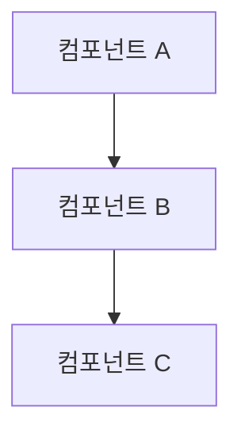
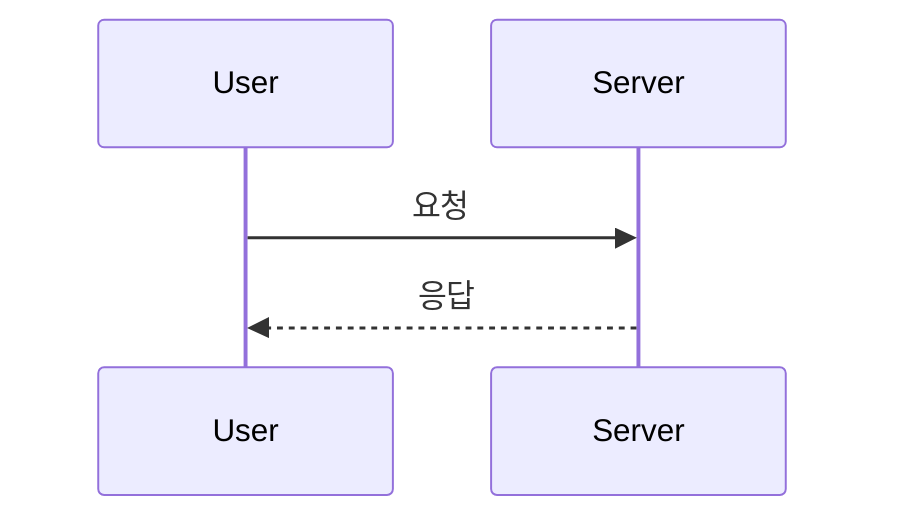
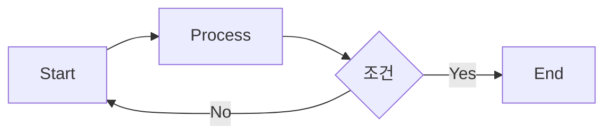

# 📝 문서 작성 가이드

**algokit: BOJ 학습 도우미 MCP Server**
**버전**: 1.0
**마지막 업데이트**: 2026-02-13

---

## 목차
1. [문서 작성 원칙](#문서-작성-원칙)
2. [파일명 규칙](#파일명-규칙)
3. [문서 구조 및 템플릿](#문서-구조-및-템플릿)
4. [스타일 가이드](#스타일-가이드)
5. [에이전트별 책임](#에이전트별-책임)
6. [업데이트 절차](#업데이트-절차)
7. [체크리스트](#체크리스트)

---

## 문서 작성 원칙

### 1. 명확성 (Clarity)
- **간결한 제목**: 문서의 목적을 한눈에 파악할 수 있도록
- **명확한 구조**: 목차와 섹션 구분을 통한 논리적 흐름
- **용어 정의**: 기술 용어는 최초 사용 시 정의하거나 링크 제공
- **예제 포함**: 추상적 설명보다 구체적 코드 예제 우선

### 2. 일관성 (Consistency)
- **템플릿 사용**: 동일 유형의 문서는 동일한 템플릿 따르기
- **용어 통일**: 프로젝트 전체에서 동일한 용어 사용
- **형식 통일**: Markdown 스타일, 코드 블록 언어, 표 형식 통일

### 3. 최신성 (Currency)
- **코드와 동기화**: 코드 변경 시 관련 문서 동시 업데이트
- **업데이트 날짜 명시**: 모든 문서에 "마지막 업데이트" 필드 포함
- **변경 이력 기록**: 주요 변경사항은 문서 하단에 이력 기록

### 4. 접근성 (Accessibility)
- **다양한 독자 고려**: 기술 수준에 따라 정보 계층화
- **탐색 용이성**: 목차, 내부 링크, 참조 문서 링크 제공
- **검색 가능성**: 키워드, 태그, 명확한 섹션명 사용

---

## 파일명 규칙

### 기본 규칙
- **형식**: `kebab-case.md` (소문자, 하이픈 구분)
- **언어**: 영어 (한글 파일명 사용 금지)
- **확장자**: `.md` (Markdown)

### 파일명 패턴

| 문서 유형 | 파일명 패턴 | 예시 |
|----------|------------|------|
| 제품 요구사항 | `PRD.md` | PRD.md |
| 소프트웨어 요구사항 | `SRS.md` | SRS.md |
| 아키텍처 | `architecture.md` | architecture.md |
| 가이드/레퍼런스 | `<주제>-<타입>.md` | api-integration.md, tools-reference.md |
| 태스크 관리 | `tasks.md` | tasks.md |
| 테스트 스펙 | `test-spec-<phase>.md` | test-spec-phase1.md |
| 테스트 결과 | `test-results-<phase>.md` | test-results-phase1.md |
| 인덱스 | `INDEX.md` (대문자) | INDEX.md |
| 기여 가이드 | `CONTRIBUTING.md` (대문자) | CONTRIBUTING.md |

### 디렉토리 구조
```
docs/
├── INDEX.md
├── CONTRIBUTING.md
├── 01-planning/
├── 02-development/
├── 03-project-management/
└── 04-testing/
```

**번호 체계**:
- 두 자리 숫자 prefix (01, 02, 03...)
- 논리적 순서 (기획 → 개발 → 관리 → 테스트)
- 디렉토리명은 kebab-case

---

## 문서 구조 및 템플릿

### 모든 문서의 공통 헤더

```markdown
# 문서 제목

**프로젝트명**: algokit: BOJ 학습 도우미 MCP Server
**버전**: 1.0
**작성일**: YYYY-MM-DD
**마지막 업데이트**: YYYY-MM-DD
**작성자**: <에이전트명 또는 역할>
**상태**: 초안 | 리뷰 중 | 승인됨 | 아카이브됨

---

## 목차
(자동 생성 또는 수동 작성)

---
```

### 1. 기획 문서 템플릿 (PRD, SRS)

```markdown
# 문서 제목

[공통 헤더]

## 1. 개요
### 1.1 목적
### 1.2 범위
### 1.3 대상 독자

## 2. 문제 정의
(현재 상황 및 해결해야 할 문제)

## 3. 솔루션
### 3.1 핵심 기능
### 3.2 부가 기능

## 4. 요구사항
### 4.1 기능적 요구사항
### 4.2 비기능적 요구사항

## 5. 제약 조건

## 6. 우선순위 및 로드맵

---

## 변경 이력
| 날짜 | 버전 | 변경 내용 | 작성자 |
|------|------|-----------|--------|
| YYYY-MM-DD | 1.0 | 초안 작성 | project-planner |
```

### 2. 아키텍처 문서 템플릿

```markdown
# 시스템 아키텍처 문서

[공통 헤더]

## 1. 시스템 개요
### 1.1 목적
### 1.2 핵심 특징
### 1.3 배포 모델

## 2. 아키텍처 다이어그램
```mermaid
(다이어그램)
```

## 3. 컴포넌트 상세
### 3.1 컴포넌트 A
- **책임**: ...
- **의존성**: ...
- **인터페이스**: ...

## 4. 데이터 흐름
```mermaid
sequenceDiagram
(시퀀스 다이어그램)
```

## 5. 기술 스택
| 레이어 | 기술 | 버전 | 용도 |
|--------|------|------|------|

## 6. 설계 결정사항
### 6.1 결정 제목
- **문제**: ...
- **고려사항**: ...
- **결정**: ...
- **근거**: ...

## 7. 확장성 및 성능
```

### 3. 개발 가이드 템플릿

```markdown
# [주제] 가이드

[공통 헤더]

## 1. 개요
(간단한 소개 및 목적)

## 2. 시작하기
### 2.1 사전 요구사항
### 2.2 설치/설정

## 3. 기본 사용법
### 3.1 핵심 개념
### 3.2 간단한 예제

## 4. 고급 사용법
### 4.1 고급 기능
### 4.2 최적화 기법

## 5. 코드 예제
```typescript
// 실제 동작하는 코드 예제
```

## 6. 에러 처리
### 6.1 일반적인 에러
### 6.2 해결 방법

## 7. 베스트 프랙티스

## 8. 참고 자료
```

### 4. 태스크 문서 템플릿

```markdown
# 개발 태스크 목록 및 상태 관리

[공통 헤더]

## 상태 범례
- ✅ **DONE**: 완료
- 🚧 **IN_PROGRESS**: 진행 중
- 📋 **TODO**: 예정
- ⏸️ **BLOCKED**: 블로킹됨
- 🔄 **REVIEW**: 리뷰 중

## Phase N: 페이즈명
**목표**: ...
**우선순위**: 🔴 높음 | 🟡 중간 | 🟢 낮음
**예상 기간**: N주

### Task N.M: 태스크명
**상태**: 🚧 IN_PROGRESS
**담당**: <에이전트명>
**우선순위**: P0 | P1 | P2
**예상 소요**: N일
**시작일**: YYYY-MM-DD
**완료일**: YYYY-MM-DD (완료 시)

**설명**:
(태스크 상세 설명)

**완료 조건**:
- [ ] 조건 1
- [ ] 조건 2

**의존성**:
- 태스크 N.X 완료 필요

**참고**:
- 관련 이슈/문서 링크
```

### 5. 테스트 문서 템플릿

**테스트 스펙**:
```markdown
# Phase N 테스트 스펙

[공통 헤더]

## 테스트 개요
**테스트 목표**: ...
**테스트 범위**: ...
**커버리지 목표**: N%

## 테스트 케이스
### TC-N.M.X: 테스트명
**목적**: ...
**전제 조건**: ...
**입력**: ...
**예상 출력**: ...
**검증 조건**: ...
```

**테스트 결과**:
```markdown
# Phase N 테스트 결과

[공통 헤더]

## 테스트 실행 요약
| 메트릭 | 값 | 목표 | 상태 |
|--------|-----|------|------|
| 총 테스트 | N | - | - |
| 통과 | N | - | ✅ |
| 실패 | N | 0 | ✅/❌ |
| 커버리지 | N% | N% | ✅/❌ |

## 커버리지 분석
(상세 분석)

## 발견된 이슈
| ID | 심각도 | 설명 | 상태 |
|----|--------|------|------|

## 다음 단계
```

---

## 스타일 가이드

### Markdown 형식

#### 제목 계층
```markdown
# H1 - 문서 제목 (1개만)
## H2 - 주요 섹션
### H3 - 하위 섹션
#### H4 - 상세 항목
```

#### 강조
```markdown
**굵게** - 중요한 용어, 키워드
*기울임* - 강조, 변수명
`코드` - 함수명, 파일명, 짧은 코드
```

#### 코드 블록
````markdown
```typescript
// 언어 명시 필수
const example = "hello";
```
````

**지원 언어**: `typescript`, `javascript`, `json`, `bash`, `mermaid`, `markdown`

#### 리스트
```markdown
- 순서 없는 리스트
  - 하위 항목 (2칸 들여쓰기)

1. 순서 있는 리스트
2. 두 번째 항목
```

#### 표
```markdown
| 컬럼1 | 컬럼2 | 컬럼3 |
|------|------|------|
| 값1  | 값2  | 값3  |
```

**정렬**:
- 왼쪽 정렬: `|------|`
- 가운데 정렬: `|:------:|`
- 오른쪽 정렬: `|------:|`

#### 링크
```markdown
[링크 텍스트](URL)
[상대 경로 링크](./other-doc.md)
[섹션 링크](#섹션-제목)
```

#### 이미지
```markdown

```

### 다이어그램 (Mermaid)

#### 시스템 구조도


#### 시퀀스 다이어그램


#### 플로우차트


### 용어 통일

| 올바른 용어 | 피해야 할 용어 |
|------------|---------------|
| MCP 서버 | mcp server, MCP서버 |
| solved.ac API | Solved.ac API, solvedAC |
| 백준 온라인 저지 (BOJ) | 백준OJ, Baekjoon |
| 티어 (Tier) | 난이도, 레벨 (문맥에 따라) |
| 문제 (Problem) | 퀘스트, 과제 |
| 태그 (Tag) | 알고리즘, 분류 |
| 힌트 (Hint) | 팁, 도움말 |
| 복습 문서 (Review) | 복기, 회고 |

### 문체 및 톤

- **경어 사용**: "~합니다", "~해주세요" (명령형 "~하라" 지양)
- **능동태 우선**: "사용자가 입력하면" > "입력되면"
- **구체적 표현**: "약 80% 이상" > "높은 수준"
- **간결함**: 한 문장은 2줄 이내 권장

---

## 에이전트별 책임

### project-planner
**역할**: 제품 기획 및 프로젝트 관리

**작성 문서**:
- `docs/01-planning/PRD.md`
- `docs/01-planning/SRS.md`
- `docs/03-project-management/tasks.md`

**업데이트 주기**:
- PRD/SRS: 요구사항 변경 시
- tasks.md: 매일 (진행 상황 반영)

**책임 범위**:
- 제품 비전 및 요구사항 정의
- 태스크 생성, 우선순위 지정, 상태 업데이트
- Phase 계획 수립 및 마일스톤 관리

### fullstack-developer
**역할**: 코드 구현 및 기술 문서화

**작성 문서**:
- `docs/01-planning/architecture.md`
- `docs/02-development/api-integration.md`
- `docs/02-development/tools-reference.md`

**업데이트 주기**:
- 코드 변경 시 즉시 업데이트
- 새로운 도구/API 추가 시

**책임 범위**:
- 시스템 아키텍처 설계 및 문서화
- API 통합 가이드 작성
- MCP 도구 레퍼런스 업데이트
- 코드 예제 및 베스트 프랙티스 제공

### qa-testing-agent
**역할**: 테스트 계획 및 품질 관리

**작성 문서**:
- `docs/04-testing/test-spec-phase<N>.md`
- `docs/04-testing/test-results-phase<N>.md`

**업데이트 주기**:
- test-spec: 테스트 계획 시
- test-results: 테스트 실행 후

**책임 범위**:
- 테스트 케이스 작성 및 검증 조건 정의
- 테스트 실행 및 결과 리포트 작성
- 커버리지 분석 및 품질 메트릭 추적
- 이슈 발견 및 문서화

### technical-writer
**역할**: 문서 품질 관리 및 개선

**작성 문서**:
- `docs/INDEX.md`
- `docs/CONTRIBUTING.md`
- 모든 문서 (리뷰 및 개선)

**업데이트 주기**:
- 문서 체계 변경 시
- 주기적 문서 리뷰 (주 1회 권장)

**책임 범위**:
- 문서 구조 및 체계 설계
- 문서 작성 가이드라인 수립
- 모든 문서의 일관성, 명확성, 접근성 검토
- 용어 통일 및 스타일 가이드 적용
- 문서 간 링크 및 탐색성 개선

---

## 업데이트 절차

### 1. 문서 생성 절차
1. **템플릿 선택**: 문서 유형에 맞는 템플릿 사용
2. **공통 헤더 작성**: 제목, 버전, 날짜, 작성자 등
3. **내용 작성**: 섹션 구조 따라 작성
4. **자체 검토**: 체크리스트 확인
5. **커밋**: 커밋 메시지에 `[docs]` 태그 포함

### 2. 문서 수정 절차
1. **"마지막 업데이트" 날짜 갱신**
2. **변경 내용 작성**
3. **관련 문서 동기화**: 영향받는 다른 문서도 업데이트
4. **변경 이력 기록** (주요 변경 시)
5. **커밋**: `[docs] 문서명: 변경 내용 요약`

### 3. 문서 아카이브 절차
1. **상태를 "아카이브됨"으로 변경**
2. **아카이브 이유 명시**
3. **대체 문서 링크** (있을 경우)
4. **파일 이동**: `docs/archive/` 디렉토리로 이동 (선택사항)

### 4. Git 커밋 메시지 규칙

```
[docs] 문서 카테고리: 간단한 설명

- 변경사항 1
- 변경사항 2

Co-Authored-By: Claude Sonnet 4.5 <noreply@anthropic.com>
```

**예시**:
```
[docs] planning: PRD에 Phase 3 요구사항 추가

- Phase 3 기능 목록 추가
- 우선순위 재조정
- 예상 일정 업데이트
```

---

## 체크리스트

### 문서 작성 완료 체크리스트

#### 모든 문서 공통
- [ ] 공통 헤더 작성 (제목, 버전, 날짜, 작성자, 상태)
- [ ] 목차 포함 (3개 이상 섹션일 때)
- [ ] 구분선 (`---`) 사용하여 섹션 구분
- [ ] 용어 통일 확인
- [ ] 링크 작동 확인
- [ ] 오타 및 문법 검토
- [ ] "마지막 업데이트" 날짜 정확함

#### 기획 문서 (PRD, SRS)
- [ ] 문제 정의 명확함
- [ ] 요구사항 구체적이고 측정 가능함
- [ ] 우선순위 명시됨
- [ ] 제약 조건 기술됨

#### 아키텍처 문서
- [ ] 시스템 다이어그램 포함
- [ ] 컴포넌트 책임 명확함
- [ ] 데이터 흐름 설명됨
- [ ] 기술 스택 버전 명시됨
- [ ] 설계 결정 근거 기술됨

#### 개발 가이드
- [ ] 실제 동작하는 코드 예제 포함
- [ ] 에러 처리 방법 설명됨
- [ ] 베스트 프랙티스 제시됨
- [ ] 참고 자료 링크 제공됨

#### 태스크 문서
- [ ] 모든 태스크에 상태 아이콘 표시
- [ ] 담당자 명시됨
- [ ] 완료 조건 구체적임
- [ ] 의존성 명시됨

#### 테스트 문서
- [ ] 테스트 케이스에 입력/출력 명시
- [ ] 검증 조건 명확함
- [ ] 커버리지 목표 설정됨
- [ ] 실제 테스트 결과와 일치함

### 문서 리뷰 체크리스트

#### 명확성 (Clarity)
- [ ] 문서 목적이 즉시 파악됨
- [ ] 기술 용어가 정의되거나 링크됨
- [ ] 예제가 이해를 돕는가
- [ ] 한 섹션이 하나의 주제만 다룸

#### 일관성 (Consistency)
- [ ] 동일한 템플릿 사용
- [ ] 용어가 프로젝트 전체와 일치
- [ ] Markdown 스타일 통일
- [ ] 코드 블록 언어 명시됨

#### 최신성 (Currency)
- [ ] 코드와 동기화됨
- [ ] "마지막 업데이트" 날짜 최신
- [ ] 더 이상 유효하지 않은 내용 없음
- [ ] 향후 계획이 명확히 구분됨

#### 접근성 (Accessibility)
- [ ] 신규 팀원이 이해할 수 있음
- [ ] 목차로 쉽게 탐색 가능
- [ ] 관련 문서로 링크 제공됨
- [ ] 검색 키워드가 적절함

---

## 자주 묻는 질문 (FAQ)

### Q1. 문서를 언제 업데이트해야 하나요?
**A**: 코드 변경과 동시에 업데이트하는 것이 원칙입니다. 특히 다음 경우 필수입니다:
- 새로운 기능 추가
- API 변경
- 아키텍처 수정
- 태스크 상태 변경

### Q2. 어떤 내용까지 문서화해야 하나요?
**A**: "3개월 후 다른 개발자가 이해할 수 있을까?"를 기준으로 판단하세요. 자명한 내용은 생략하되, 의사결정 배경, 제약 조건, 주의사항은 반드시 기록합니다.

### Q3. 문서가 너무 길어지면 어떻게 하나요?
**A**: 섹션을 별도 문서로 분리하고 링크로 연결하세요. 예를 들어, "API 레퍼런스"가 너무 길면 각 엔드포인트를 별도 파일로 분리할 수 있습니다.

### Q4. 코드 예제는 어떻게 관리하나요?
**A**: 가능하면 실제 프로젝트 코드를 참조하거나, 테스트 코드에서 추출하세요. 별도의 예제 파일을 만들 경우 `examples/` 디렉토리에 관리합니다.

### Q5. 다이어그램은 어떻게 작성하나요?
**A**: Mermaid를 사용하여 Markdown 내에 직접 작성합니다. 복잡한 다이어그램은 외부 도구(draw.io 등)로 작성 후 이미지로 포함할 수 있습니다.

---

## 참고 자료

### 내부 문서
- [INDEX.md](INDEX.md) - 문서 인덱스
- [CLAUDE.md](../CLAUDE.md) - 프로젝트 가이드

### 외부 자료
- [Markdown Guide](https://www.markdownguide.org/)
- [Mermaid 문서](https://mermaid.js.org/)
- [Technical Writing Best Practices](https://developers.google.com/tech-writing)

---

## 문서 개선 제안

문서 작성 가이드에 대한 개선 제안이 있으시면 technical-writer 에이전트에게 요청하거나, 이슈를 생성해주세요.

**연락처**: technical-writer agent
